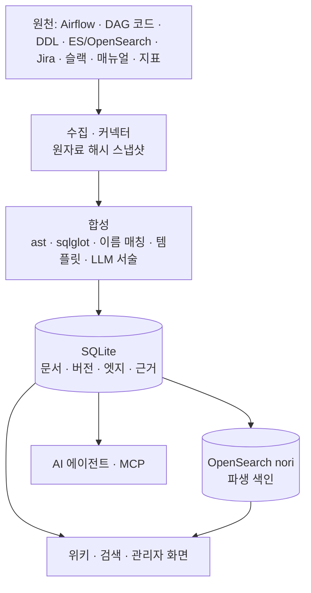

# ai-opspedia

> 추천 배치 시스템과 검색 인덱스를 위한 **운영 백과사전** — DAG 코드 · 테이블 DDL · 인덱스 메타데이터 · 장애 기록 · 런북을 한 곳의 링크된 위키로 자동 합성

   

새벽 3시에 "이 DAG 가 실패했다. 뭘 하는 DAG 고, 어디까지 영향이 가고, 누가 온콜이고, 지난번엔 어떻게 고쳤나?"를 **도구 다섯 개 대신 페이지 한 장**으로 답하는 것이 목표입니다. 사실(스케줄 · 리니지 · 상태)은 코드와 API 를 결정적으로 파싱해 만들고, LLM 은 근거를 인용한 서술만 보탭니다.

- 📐 설계 문서: [docs/overview.md](docs/overview.md) · PoC 결과: [docs/mvp-poc.md](docs/mvp-poc.md) · [결과 보고(스토리)](docs/poc-story.md)
- 🧪 동작하는 PoC: [poc/](poc/README.md) — dummy 데이터로 바로 실행

## 주요 기능

| 기능 | 설명 |
|---|---|
| **결정적 지식 합성** | DAG 파이썬 코드를 실행 없이 `ast` 로 읽고, SQL 은 `sqlglot` 으로 읽기 · 쓰기 테이블을 가려 DAG ↔ 테이블 ↔ 인덱스 리니지 그래프 생성 |
| **엔티티 추출 추적** | 모든 관계에 영수증(방법 · 원자료 · 줄 · 원문 발췌) — 원본에 실제로 있는지, 페이지에 실제로 쓰였는지 자동 검증 |
| **한국어 검색** | OpenSearch `analysis-nori` 형태소 분석 + 식별자 · 바이그램 필드, 구글식 결과 탭 · 지식 패널 |
| **자연어 질의 (AI 답변)** | 규칙 기반 의도 · 엔티티 해석 + LLM 검색어 재작성, 문장마다 인용 검증 |
| **장애 원자료 합성** | Jira · 알림 · 슬랙 · 포스트모템 → 근거 조각 → LLM 구조화(인용 필수) → 검증 → 장애 지식 |
| **서비스 지표** | SLO 판정 · 7일 추세 · 3σ 이상 탐지 파이프라인 |
| **운영 화면** | 실행 이력 · 단계별 소요 · 버전 diff · 문서 업로드(txt · html · Confluence XML) · 엔티티별 되돌리기(undo) |
| **에이전트 연동** | `/api/context` 한 번 호출로 장애 대응 컨텍스트, MCP 도구 서버 |

## 아키텍처



- **SQLite 가 유일한 기준 원본**, 검색 색인은 언제든 재생성 가능한 파생 데이터 ([ADR-020](docs/decisions.md#adr-020))
- LLM 상한은 사내 **GPT-OSS-120B**(OpenAI 호환 API), 엔드포인트가 없으면 로컬 대역 모델로 처리하고 실제 모델을 기록 ([ADR-018](docs/decisions.md#adr-018))
- PoC 는 오픈소스 부품을 인터페이스 뒤에 두어 본 구현에서 모듈 단위 교체 ([ADR-021](docs/decisions.md#adr-021))

## 빠른 시작

요구 사항: macOS 또는 Linux, `curl`, `tar`. Python · Java 는 스크립트가 프로젝트 폴더 안에 설치합니다 (시스템 변경 없음).

```sh
git clone https://github.com/huklee/ai-opspedia.git
cd ai-opspedia/poc

# 가벼운 모드: Java · OpenSearch · LLM 없이 (SQLite 검색 · mock LLM)
scripts/setup.sh --lite
uv run opspedia-poc -c config.lite.yaml seed-history   # dummy 데이터로 1주 실행 이력 재현
uv run opspedia-poc -c config.lite.yaml serve --http   # → http://127.0.0.1:8443
```

전체 기능(nori 한국어 검색 · 로컬 LLM)은 [poc/README.md](poc/README.md#설치) 를 참고하세요.

## 문서

| 문서 | 내용 |
|---|---|
| [overview.md](docs/overview.md) | 목표 · 아키텍처 · 설계 원칙 · 배포 계획 |
| [options.md](docs/options.md) · [decisions.md](docs/decisions.md) | 방식 비교 · ADR 기록 |
| [components/](docs/components/) | 수집 · 합성 · 저장 · 카탈로그 · 검색 API · 프런트엔드 |
| [mvp-poc.md](docs/mvp-poc.md) | PoC 범위 · 오픈소스 구성 · 가설별 결과 · **지식 합성 쉽게 보기** |
| [incident-synthesis.md](docs/incident-synthesis.md) · [nl-search.md](docs/nl-search.md) | 장애 원자료 합성 · 자연어 검색 설계 |
| [synthesis-scenarios.md](docs/synthesis-scenarios.md) | 같은 합성 기계를 분류기 · 파서로 쓰는 시나리오 |
| [roadmap.md](docs/roadmap.md) | 마일스톤 · 작업 목록 |

## 프로젝트 상태

- **PoC** (dummy 데이터). 검증된 것: 코드 · API 만으로 페이지 생성, 장애 대응 드릴, 에이전트 컨텍스트 API
- 실데이터가 필요한 것: 한국어 검색 품질 판정, 실제 GPT-OSS-120B 서술 품질 — [결과 요약](docs/mvp-poc.md#9-구현-현황-2026-09-29-dummy-데이터-2차)

## 기여

이슈와 PR 을 환영합니다.

1. 이슈로 제안 · 버그를 먼저 공유
2. `poc/` 에서 `uv run pytest -q` 가 통과하는지 확인 (OpenSearch · LLM 없이 실행됨)
3. 문서는 한국어, 불릿 구조 · 명사형 종결 스타일을 따름

## 라이선스

아직 정하지 않았습니다 — 라이선스 파일이 추가되기 전까지는 저작권자 허락 없이 재사용할 수 없습니다.
