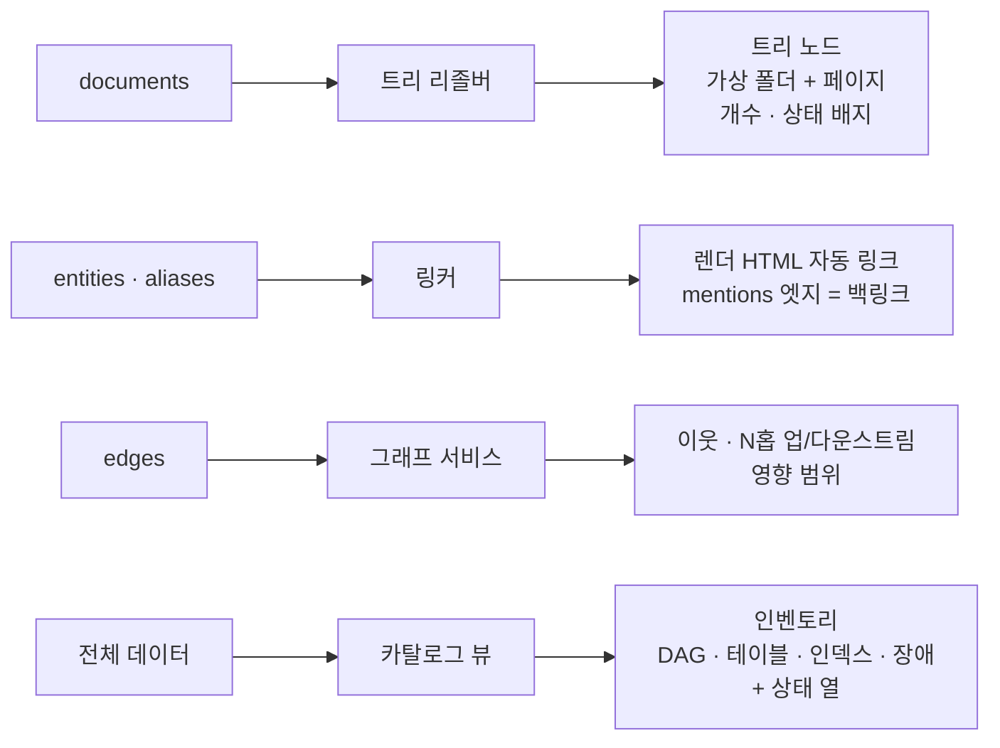

# 4. 트리·카탈로그 관리자 (`opspedia/catalog/`)

## 1. 한눈에 보기

- **구조** 담당
  - 페이지의 트리 위치, 엔티티 목록, 페이지·엔티티 간 연결, 의존 관계
- 평평한 문서 집합을 탐색 가능한 구조("Systems › Reco › DAGs")로 변환
- "`dw.user_features`가 늦으면 무엇이 깨지나?" 같은 질문에 답하는 기반

## 2. Tree Resolver
- 문서 ID(`Systems/Reco/DAGs/feature_store_daily`) 기반 **경로 트리** 구성
  - 중간 폴더는 가상 폴더
  - 그 폴더에 해당하는 `index.md` 형태의 문서가 있으면 폴더 자체 페이지로 사용
- 최상위 분류 체계(설정으로 편집 가능): `Systems/`, `Search/`, `Runbooks/`, `Incidents/`, `Manuals/`, `Teams/`, `Notes/`
- 정렬: frontmatter `sort_key` → 타입 순서(overview, pipelines, DAGs, schemas, indices…) → 제목
- 노드 payload: `{id, title, type, status, children_count, has_page, badges: [stale, failing, sla-critical]}`
  - 폴더는 필요할 때 로드(children 엔드포인트)
  - 평탄화한 캐시는 실행 종료마다 재생성
- 이동: `tree_path` 변경 시 DB 트랜잭션 하나로 처리([ADR-020](../decisions.md#adr-020))
  - 갱신 대상: 문서·청크·엔티티·엣지·**`redirects`** 테이블
  - 예전 링크도 계속 동작

## 3. 엔티티 레지스트리와 링커 (Backlink & Cross-reference Engine)
- 레지스트리 = `entities` + `aliases`(dag_id, 스키마 포함/미포함 테이블명, 인덱스명, alias명, 장애 ID, 팀 핸들)
  - 파싱한 사실 정보로 구성
  - LLM이 추출한 언급
    - 레지스트리와 대조해 해석
    - 서술만 보고 엔티티를 새로 만들지 않음
    - 이런 언급은 `unresolved` lint 이슈로 처리
  - **nori 사용자 사전의 원천**([ADR-019](../decisions.md#adr-019))
    - 레지스트리의 식별자(DAG·테이블·인덱스·alias 이름)를 `user_dictionary_rules`로 내보냄
    - 형태소 분석에서 식별자 분리 방지
- **렌더링 시점 자동 링크**
  - Aho–Corasick 한 번(alias 집합 대상 직접 구현)을 markdown-it 텍스트 토큰에 적용
    - HTML 문자열에는 절대 적용 금지
  - 식별자를 엔티티 페이지 링크로 감쌈
    - 제외: 코드 블록, 인라인 코드, 제목, 기존 링크
  - 단어·식별자 경계에서만 매칭, 가장 긴 매칭 우선
- 백링크
  - 구성: `rel = mentions`인 `edges` + 명시적 관계
  - 페이지마다 *Referenced by*를 타입별로 묶어 표시
- 명시적 위키 링크 `[[dag:reco.feature_store_daily]]` / `[[Systems/Reco/DAGs/…|label]]` 지원

## 4. 그래프 서비스 ([ADR-012](../decisions.md#adr-012))
| 쿼리 | SQL 형태 | 사용처 |
|---|---|---|
| neighbors(entity, rels?) | `edges(src)` + `edges(dst)` 인덱스 조회 | 엔티티 페이지 사이드 패널 |
| downstream(entity, depth ≤ 4) / upstream | 순환 방지(`path NOT LIKE '%'||dst||'%'`) 재귀 CTE | **영향 범위** 패널 · 에이전트 `impact` 도구 |
| path(a, b) | 캐시한 인접 리스트 위 Python 양방향 BFS | "X와 Y는 어떻게 연결되나" |
| incidents_for(entity, transitive) | downstream/upstream ∪ `affected` 엣지 | "알려진 장애" 섹션 |

- 인접 리스트
  - 메모리 캐시(엣지 수천 개 수준)
  - 실행 종료 시 갱신
- 출력은 JSON
  - 프런트엔드가 렌더링할 Mermaid `graph LR` 스니펫 선택적 포함

## 5. 카탈로그 뷰와 상태 점검

- 인벤토리 표(정렬·필터 가능)
  - 전체 DAG: 스케줄, owner, 스냅샷 기준 마지막 실행 상태, 7일간 실패 수, SLA, 페이지 상태
  - 전체 테이블: 생산 DAG, 소비자, 최신성 SLA
  - 전체 **인덱스 패밀리**: alias → 현재 쓰기/읽기 인덱스, health, 문서 수, 크기, 수명 주기 단계, 빌더 DAG, 현재 인덱스 나이
  - 서비스
  - 장애: 심각도, 영향 대상, 런북 링크
- 검색 인덱스 상태 점검
  - 스냅샷마다 계산
  - 배지와 lint에 표시

| 점검 | 규칙 (기본값은 설정 가능) |
|---|---|
| 인덱스 health | 인덱스나 클러스터 중 하나라도 `red`면 critical · `yellow`면 warning |
| alias 최신성 | alias가 가리키는 인덱스가 빌더 DAG의 마지막 성공 실행**보다 오래됨**(alias 전환 누락) → warning |
| 빌드 최신성 | 현재 인덱스 나이 > 패밀리의 최신성 기대치(예: 일간 빌드는 26 h) → warning |
| 업스트림 최신성 | 빌더가 읽는 테이블의 생산 DAG들이 인덱스 빌드 전 마지막으로 성공한 시점 → "… 시점 데이터로 빌드됨" 표시 · 웨어하우스 접근 불필요 |
| 문서 수 변동 | 현재 docs.count가 이전 버전 / 이전 스냅샷 대비 20 % 넘게 감소 → warning |
| 고아 | 어느 패밀리에도 없는 인덱스 · 없는 인덱스를 가리키는 alias · 빌더 DAG가 없는 패밀리 |
| 매핑 변경 | 매핑 해시가 이전 버전과 다름 → info · 패밀리 페이지에 diff 표시 |

- 완성도 스코어카드 (Backstage 참고)
  - 항목: owner 지정 · summary 작성 · SLA-critical DAG의 런북 연결 · 최신성 SLA 문서화 · 90일 안에 리뷰 완료
  - 시스템별 화면과 lint에 표시
- 파이프라인(설정: DAG 목록 또는 태그)은 M1b에서 결정적 렌더링
  - DAG 순서(`waits_for` 엣지 기준, 없으면 스케줄로 대체)
  - 생성하는 테이블과 인덱스 패밀리
  - Mermaid 리니지 다이어그램
  - 각 DAG 페이지 링크
  - M2 추가 항목
    - LLM 개요
    - 시스템마다 사람이 쓴 "Start here" 페이지를 맨 위에 고정
- **컬럼 단위 영향 분석**
  - `column:user_age` 검색과 테이블 페이지의 *Columns used by* 섹션
    - `columns_read` / `columns_written`에 그 컬럼이 있는 태스크 전부 표시
  - `unknown_columns`(`SELECT *`)가 있는 태스크는 "사용 가능성 있음"으로 표시
  - 컬럼 이름 변경 시 "무엇이 깨지나"에 컬럼 단위로 답변 가능

## 6. Lint (카탈로그 부분, 야간 실행 + 인덱스 점검은 스냅샷 직후에도 실행)
- 대상
  - 고아 페이지(부모·링크 없음), 깨진 링크, 해석되지 않은 언급, 페이지 없는 엔티티
  - REST↔AST 불일치, 없는 인덱스를 가리키는 alias, 오래된 verified 페이지, `upstream_of` 순환
- 결과
  - `/admin/lint`에 표시
  - 원하면 팀 채널로 요약 발송

## 7. 작업 목록 (일정의 기준 원본(source of truth): [roadmap.md](../roadmap.md), Pri = 마일스톤 내 우선순위)
| 마일스톤 | Pri | 작업 |
|---|---|---|
| M1a | P0 | tree resolver + children 지연 로딩 API · 엔티티 레지스트리 · 인벤토리(DAG, 테이블, 인덱스 패밀리) · **파싱한 엣지 + 단순 다운스트림 목록**(reads/writes/builds/waits_for) |
| M1a | P0 | **검색 인덱스 상태 점검**(health, alias와 빌더 최신성 비교, 빌드 나이, 문서 수 변동, 고아, 매핑 변경) · 생산 DAG의 마지막 성공 시점 기준 업스트림 최신성 |
| M1b | P0 | 설정으로 정의한 파이프라인(렌더링 + 리니지) · 컬럼 단위 영향 분석(`column:` 검색, *Columns used by*) |
| M3 | P0 | Aho–Corasick 자동 링커 · 백링크 · `[[wiki links]]` · 그래프 서비스(neighbors, upstream/downstream, 영향 범위) + Mermaid |
| M3 | P1 | 전체 lint · 설정 기반 서비스 엔티티 |
| later | P2 | 완성도 스코어카드 · path(a,b) · 분류 체계 편집 UI |
