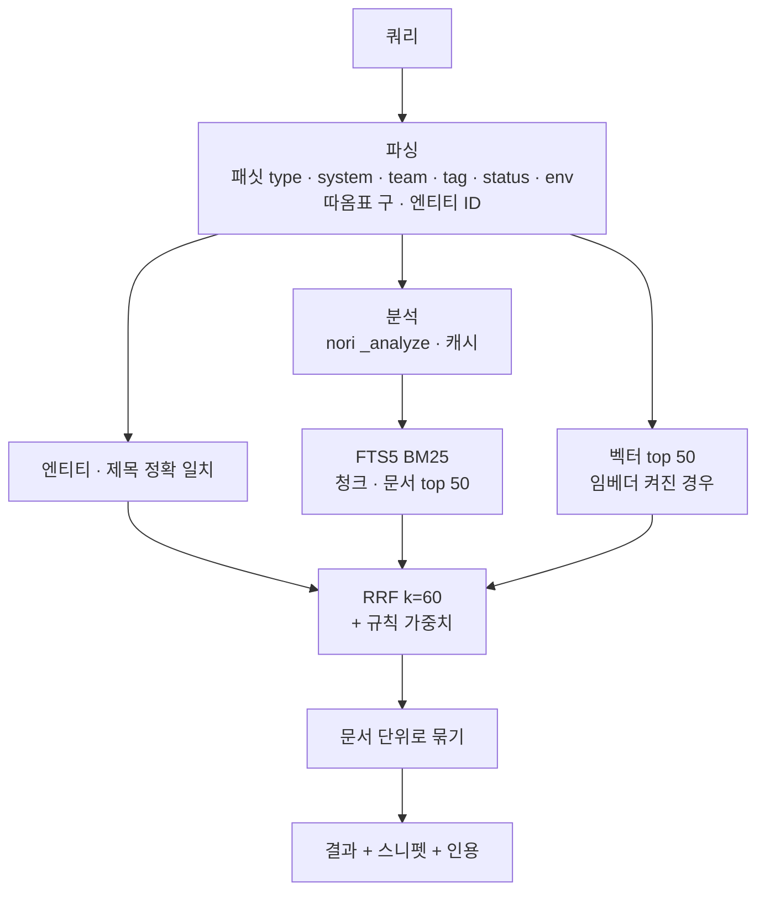

# 5. 검색 & 조회 API (`opspedia/api/`)

## 1. 한눈에 보기

- JSON API 하나로 위키 UI와 외부 AI 에이전트 / AIOps 서비스를 함께 지원
- 검색 방식은 **하이브리드 검색**
  - BM25(키워드, 식별자, 한국어)와 벡터(의미) 결과를 RRF로 합침
  - LLM 없이 RRF + 규칙 기반 가중치로만 순위 결정([ADR-018](../decisions.md#adr-018))
- 모든 결과에 인용 포함

## 2. 엔드포인트 (v1)

| 메서드 & 경로 | 용도 | 인증 |
|---|---|---|
| `GET /api/search?q=&type=&system=&team=&tag=&status=&env=&path=&updated_after=&updated_before=&limit=&mode=hybrid|keyword|semantic` | 순위별 문서 + 최적 청크 스니펫(하이라이트) + 패싯별 개수(type, system, team, tag, status, env, 최상위 경로 = *카테고리*, 수정일 구간: 7d / 30d / 90d / older) | viewer |
| `GET /api/suggest?q=` | ⌘K: 제목/엔티티 접두어 매칭 + 상위 결과, 50 ms 미만 | viewer |
| `GET /api/pages/{id}` | 페이지(frontmatter, HTML, 원본 Markdown, 목차, 상태, 출처, 백링크) | viewer |
| `GET /api/pages/{id}/history?diff=<v1>..<v2>` | 버전 목록(`document_versions`: 버전, 시각, `run_id`/사용자, `change_note`) + 두 버전 간 diff(`difflib`)([ADR-020](../decisions.md#adr-020)) | viewer |
| `GET /api/tree?parent=` | 노드 자식 목록(지연 로딩) | viewer |
| `GET /api/tree/context?id=&depth=` | **Tree Context Provider**: 노드 + 조상(브레드크럼 + 요약) + 자식 요약 + 핵심 사실 정보 · 에이전트와 UI가 한 번의 호출로 수신 | viewer |
| `GET /api/context?dag_id=&task_id=` · `?index=` · `?entity=` | 알림 핸들러·에이전트용 원콜 묶음: 엔티티, 요약, 실시간 상태(60초 캐시), 다운스트림(2홉 이내), 알려진 장애, 런북, 온콜, 링크, 페이지 URL | 토큰 `read` / viewer |
| `GET /e/{entity_id}` | 엔티티 현재 페이지로 고정 리다이렉트(Airflow `doc_md`, 콜백, 알림 템플릿용) | viewer |
| `GET /api/entities/{id}` | 엔티티 속성, 문서, 이웃, 스냅샷 | viewer |
| `GET /api/graph/{id}?dir=down|up&depth=` | 영향 범위 / 리니지(JSON + Mermaid) | viewer |
| `GET /api/catalog/{dags|tables|index-families|services|incidents}` | health 컬럼 포함 인벤토리 | viewer |
| `GET /api/health/indices` | 검색 인덱스 상태 점검([04-catalog](04-catalog.md) §5) | viewer |
| `POST /api/retrieve` | 에이전트 RAG: `{question, filters, k}` → 컨텍스트 헤더 붙은 상위 청크, 인용, 토큰 예산 맞춤 패킹 | 토큰 `read` |
| `POST /api/feedback` | 결과·페이지별 좋아요/싫어요 + 메모(평가 세트에 반영) | viewer/token |
| `POST /api/pages/{id}/review` | `reviewed/verified`로 설정 · `stale` 페이지는 재생성 / 유지 중 선택 | editor |
| `POST /api/pages/{id}/sections/{name}/correction` | 섹션에 사람의 정정 저장(`human:` 블록) | editor |
| `POST /hooks/{source}` | tailnet 안 발신자의 수집 웹훅(P2, 기본은 폴링) | 서명 |
| `/admin/*` | 실행 기록, lint, 계정, 토큰, 처리량 게이트 | admin |

- `rerank` 파라미터는 없음(LLM 리랭크 삭제, [ADR-018](../decisions.md#adr-018))
- OpenAPI 문서: `/api/docs`(FastAPI)
  - 에이전트 연동 쪽에는 이 문서가 계약

## 3. 랭킹 세부 사항 ([ADR-005](../decisions.md#adr-005), [ADR-019](../decisions.md#adr-019))

- 쿼리 분석
  - 문서와 같은 nori `_analyze`(캐시)
  - 동의어 쿼리 확장
  - 결과 부족 시 바이그램 OR 완화([03-storage](03-storage.md) §4)
- 후보 생성
  - 청크 단위 BM25 상위 50개
  - 벡터 상위 50개(패싯 사전 필터 후)
  - 엔티티/제목 정확 일치
- BM25 컬럼 가중치: nori(`ko`) > 식별자(`ident`) > 바이그램(`bigram`)
  - 제목·요약·컨텍스트 컬럼은 그보다 위
  - 구체 값은 한국어 평가 세트(§7)로 결정
- 결합: 목록마다 `score = Σ 1/(60 + rank_i)`
  - 엔티티 ID가 정확히 일치하면 무조건 1위
  - 작은 사전 가중치: `verified +10 %`, `stale −10 %`
  - `archived`는 `status=archived`로 요청할 때만 포함
- 문서 단위 묶기: 문서별 최적 청크 + 추가 스니펫 최대 2개
- LLM 리랭크 없음: 최종 순위는 RRF + 규칙 기반 가중치만([ADR-018](../decisions.md#adr-018))
- 스니펫/하이라이트는 Python에서 생성
  - FTS5 `snippet()`은 분석된 토큰 텍스트를 반환하므로 사용 안 함
  - 쿼리 시점에 상위 ~10개 청크를 다시 분석(`analysis_cache` 적중)해 nori 토큰 기준으로 원문 일치 구간 탐색
  - 일치가 가장 촘촘한 약 200자 구간을 잘라 일치 부분을 `<mark>`로 감쌈
- 벡터 후보는 top-k를 뽑기 *전에* 패싯 행 마스크로 필터링([03-storage](03-storage.md) §5)

## 4. 에이전트에 보장하는 것

- 반환하는 모든 청크에 `{doc_id, heading_path, url, sources[], status, updated_at}` 포함
  - 에이전트의 인용·최신성 판단 근거
  - `stale`/`generated` 상태도 명시
- `/api/retrieve`는 호출자가 준 `max_tokens`(기본값 4 000)에 맞춰 패킹
  - 가능하면 서로 다른 문서 우선
- JSON 형태는 결정적(deterministic)
  - 버전 표기(`/api/v1/...`은 `/api/...`의 alias)

## 5. 성능 목표 (단일 호스트)
| 호출 | p95 목표 |
|---|---|
| suggest | 50 ms |
| search(keyword/hybrid, 쿼리 분석 포함) | 150 ms |
| 페이지 렌더링(캐시된 HTML) | 80 ms |

- search 150 ms에는 쿼리 분석(nori `_analyze`, 캐시 미스 시) 추가 지연 p95 +20 ms 이내 포함
- suggest는 제목/엔티티 접두어 매칭이라 `_analyze` 미호출

## 6. 성공 지표 (`search_log`, `feedback`, 감사 로그 기준)

- 주간 활성 사용자
- 결과 없음 비율(한국어 쿼리 별도 집계)
- 한국어 검색 품질: 평가 세트 기준 recall@5, MRR@10, 무결과율(§7)
- 상위 3개 결과 클릭률
- 피드백 👎 비율
- 리뷰를 마친 SLA 핵심 페이지 비율
- 포스트모템에서 인용된 opspedia 링크 수
- 모두 `/admin/metrics`에 표시

## 7. 평가 (`opspedia eval search`)

- 평가 세트: 운영자와 `feedback`에서 모은 실제 질문 **80–100개**와 질문별 기대 문서
  - 그중 한국어 **60개 이상**([ADR-019](../decisions.md#adr-019))
- 한국어 질의 유형
  - 조사 변형(장애가/장애를)
  - 띄어쓰기 변형(장애 대응/장애대응)
  - 복합어(추천배치파이프라인)
  - 한영 혼용(alias 전환)
  - 약어·동의어(피처/feature)
  - 식별자(feature_store_daily)
  - 자연어 질문
- 지표: recall@5, MRR@10, 무결과율
- 목표
  - 한국어 recall@5 **≥ 0.85**
  - MRR@10 **≥ 0.7**
  - 무결과율 **< 5 %**
  - 키워드 기준치는 R1 완료 기준에 포함
- 비교군: 바이그램 단독 / nori / nori + 바이그램 / (+ 벡터)
  - 컬럼 가중치도 이 비교로 결정
- 목표 미달 시 키워드 검색만 전용 ES/OpenSearch 인덱스로 이전 검토([03-storage](03-storage.md) §4)
- 분석기·사용자 사전·임베더 변경 때마다 실행
  - 결과는 `data/evals/`에 저장

## 8. 작업 목록 (일정의 기준 원본(source of truth)은 [roadmap.md](../roadmap.md), Pri = 마일스톤 안에서의 우선순위)
| 마일스톤 | Pri | 작업 |
|---|---|---|
| M0 | P0 | 인증 미들웨어(Tailscale `whois` → 사용자, 설정 기반 역할), 앱 뼈대 |
| M1a | P0 | 패싯 포함 검색(키워드, 문서 단위, nori 쿼리 분석 + 동의어 확장), 한국어 평가 세트로 키워드 기준치 확인(R1 완료 기준), suggest, 페이지, 트리, 카탈로그, **`/api/health/indices`**, `/e/{entity}`, 피드백, search_log |
| M1b | P0 | 읽기 토큰, **`/api/context`**(실시간 상태, 다운스트림, 런북, 온콜), `column:` 검색 |
| M2 | P0 | 평가 하네스 확장(`opspedia eval search`, 80–100개 질의, 비교군 전체), 평가에서 차이가 보이면 청크 단위 + 하이브리드 검색(벡터 + RRF), 쿼리 시점 스니펫 하이라이트 |
| M3 | P0 | 엔티티 & 그래프 엔드포인트 |
| M4 | P0 | `/api/retrieve`, `/api/tree/context`, 리뷰 액션, OpenAPI 다듬기 |
| M4 | P1 | `/api/pages/{id}/history`(버전 목록 + `difflib` diff) |
| 이후 | P2 | 이 엔드포인트들 위에 올리는 실제 MCP 서버, 웹훅, 쿼리 이해, 저장된 검색 |
