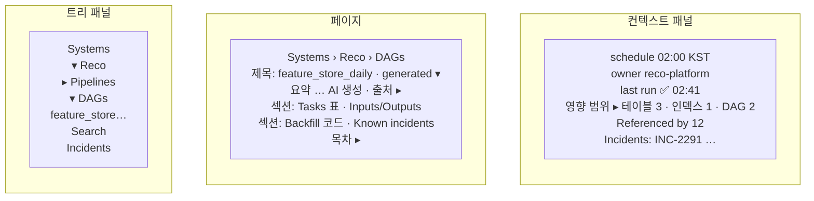

# 6. 위키 프런트엔드 뷰어 (`opspedia/frontend/`)

## 1. 한눈에 보기

- 빠른 **서버 렌더링** 뷰어([ADR-009](../decisions.md#adr-009))
  - 왼쪽 **디렉터리 트리**, 가운데 **Markdown 페이지**, 오른쪽 **컨텍스트 패널**(사실 정보, 백링크, 영향 범위, 장애)
  - 어느 화면에서든 **⌘K** 대화상자
- SPA 빌드 체인 없음
  - 작은 vanilla-JS 모듈로 HTML 위에 기능을 점진적으로 추가

## 2. 기능
| 기능 | 세부 내용 | Pri |
|---|---|---|
| 디렉터리 트리 | 폴더 지연 로딩, 필터 입력창(`/`), 상태 배지(stale ⚠, 실패 중 ●), 펼침 상태 기억, 크기 조절, 딥 링크 `/p/<id>` | P0 |
| Markdown 뷰어 | markdown-it-py 서버 렌더링 · 목차 · 출처 링크가 달린 "AI 생성 · 출처" 배너 | P0 |
| ⌘K 빠른 검색 | 모달 · 디바운스 `/api/suggest` 후 `/api/search` · 키보드 이동, 타입/시스템 칩 · Enter로 열기, ⌘Enter로 새 탭 · 최근 페이지 | P0 |
| 검색 페이지 | 패싯, 스니펫, 모드 전환(키워드/하이브리드)이 있는 전체 결과 | P1 |
| 컨텍스트 패널 | 엔티티 속성·스냅샷 기반 사실 정보, 백링크, 영향 범위(목록 + Mermaid), 관련 장애와 런북 | P1 |
| 카탈로그 뷰 | 상태 컬럼과 스코어카드가 있는 DAG / 테이블 / 인덱스 / 장애 목록 | P1 |
| **섹션 정정** | "정정" 클릭 시 현재 내용이 채워진 textarea · 저장 시 생성된 섹션을 대체하는 `human:` 블록 | P0 (R1) |
| 리뷰 동작 | 편집자: reviewed/verified 표시 · `stale` 페이지에서 사실 diff 확인 후 재생성 / 유지 · 팀 리뷰 큐(`status:generated team:X`) | P1 |
| 피드백 | 페이지·검색 결과에 👍/👎 + 메모(평가 세트와 리뷰 큐에 반영) | P0 (R1) |
| 관리자 | 실행(상태, LLM 호출 수·처리 시간, 오류), lint, 계정, API 토큰, 처리량 게이트 | P1 |
| 원문·이력 | 원문 Markdown 보기(`documents` 현재 전문) · 이력·diff 화면(`/api/pages/{id}/history`, 버전 간 `difflib` diff)([ADR-020](../decisions.md#adr-020)) | P1 |
| 편집 | 인라인 편집기는 보류(PRD의 BlockNote/TipTap → P2) | P2 |

- **보충:**
  - Markdown 뷰어 렌더링 범위: 표, 체크리스트, 각주, 제목 **앵커**(링크 복사), **줄 번호** + Pygments 코드, **수식**(KaTeX), **Mermaid**, 알림 블록(admonition)
  - Markdown 뷰어 출처 링크: 소스 파일 줄 범위·내용 해시, API 스냅샷 시각
  - 섹션 정정 주체: 편집자가 섹션의 "정정" 클릭
  - 섹션 정정 저장: DB 트랜잭션으로 즉시 기록, `document_versions`에 사람 수정본으로 영구 보관

## 3. 화면과 렌더링 규칙
- 타이포그래피
  - 터미널 스타일이 아닌 문서 읽기용, 다크/라이트 테마 지원
  - 식별자와 코드는 고정폭 글꼴
- 출처 표시
  - 생성된 페이지에는 모두 출처(`generated from …`, `updated_at`, `status`) 표시
  - `stale` 페이지엔 경고 바
- **엔티티 페이지 헤더:**
  - 온콜 연락처
  - `links:` 기반 버튼(Airflow grid, task log, Kibana, 대시보드)
  - **경과 시간이 붙은 실시간 상태**("last run ❌ failed 02:10 · as of 02:12")
- 고정 엔티티 URL `/e/<entity_id>`는 헤더에서 복사 가능(`doc_md`, 알림 템플릿용)
- 검색 스니펫 하이라이트
  - nori 토큰 기준
  - 상위 결과만 쿼리 시점에 다시 분석해 원문 위치에 표시(저장된 offset 맵 없음, [ADR-019](../decisions.md#adr-019))
- 링크: 내부는 같은 창, 외부는 새 탭(ai-research-note와 같은 규칙)
- 외부 에셋
  - 실행 중 외부 에셋 미사용(KaTeX/Mermaid는 `/static`에 포함)
  - tailnet 안에서만 써도 정상 동작
- 접근성
  - 트리와 ⌘K는 키보드만으로 전부 조작 가능
  - 트리 항목에 ARIA role
  - 로딩 중 레이아웃 밀림 없음

## 4. 구현 메모
- Jinja2 템플릿: `base.html`(셸 + 트리 + ⌘K), `page.html`, `search.html`, `catalog.html`, `admin/*.html`
- JS 모듈(ES modules, 번들러 없음): `tree.js`, `cmdk.js`, `panel.js`, `review.js`, `mermaid-init.js`
- 캐시: 페이지 HTML은 `(doc_id, content_hash, linker_version)` 키, 트리 JSON은 실행 단위
- 브라우저 테스트: 트리, ⌘K, 앵커, 리뷰 흐름, 모바일 레이아웃(ai-research-note처럼 tailnet 너머 Playwright)

## 5. 작업 목록 (일정의 기준 원본: [roadmap.md](../roadmap.md). Pri = 마일스톤 안에서의 우선순위)
| 마일스톤 | Pri | 작업 |
|---|---|---|
| M0 | P0 | 셸 + 신원(헤더에 Tailscale 로그인 표시) |
| M1a | P0 | 트리 + 페이지 뷰어(코드/줄 번호/수식/표/앵커/Mermaid) + ⌘K + 딥 링크 |
| M1a | P0 | 엔티티 헤더(온콜, 링크, 실시간 상태 + 경과 시간), 다운스트림 목록, 인덱스 패밀리 상태 배지 · 섹션 정정 · 피드백 |
| M1b | P1 | 패싯 있는 검색 페이지 · 카탈로그 뷰 · 관리자 실행/메트릭 페이지 |
| M3 | P0 | 컨텍스트 패널(사실 정보, 백링크, 영향 범위, 알려진 장애) |
| M4 | P0 | 리뷰 동작(reviewed/verified, stale → 재생성/유지), 팀 리뷰 큐 · 원문 보기 + 이력·diff 화면 · 관리자 토큰/처리량 게이트 |
| later | P2 | 인라인 편집기, 그래프 탐색 뷰, 저장된 검색 |
