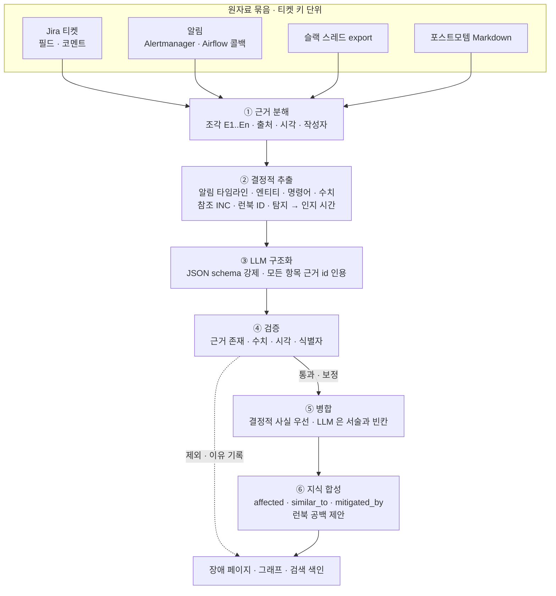

# 장애 원자료 → 장애 지식 합성 설계

> 상태: **설계 v1 + PoC 구현** · 2026-09-29 · 코드 `poc/opspedia_poc/synthesis/incident_parse.py` · 화면 생성 이력 `/e/incident:<키>/history#synthesis`
> 관련: [02-synthesis](components/02-synthesis.md) · [ADR-008](decisions.md#adr-008) · [ADR-018](decisions.md#adr-018) · [synthesis-scenarios.md](synthesis-scenarios.md)

## 1. 한눈에 보기

- **문제**
  - 장애 한 건의 사실이 Jira 티켓 · 알림 · 슬랙 스레드 · 포스트모템에 흩어짐
  - 사람이 정리한 포스트모템은 늦게 나오거나 아예 없음 (진행 중 장애)
  - LLM 에 통째로 요약시키면 근거 없는 숫자 · 시각 · 원인이 섞임
- **해법: 6단계 파서, 단계마다 결과 보관**
  - 근거를 먼저 잘게 쪼개고 번호(E1…)를 붙인 뒤, LLM 은 **번호를 인용한 항목**만 낼 수 있게 함
  - 규칙으로 되는 것(시각 · 알림 · 엔티티 · 명령어 · Jira 필드)은 LLM 전에 결정적으로 추출
  - 검증을 통과한 항목만 페이지에 반영, 결정적 사실이 항상 우선
- **PoC 결과 (dummy 3건, qwen2.5:3b 로컬 Ollama)**

| 장애 | 근거 조각 | LLM 항목 | 통과 | 보정 | 주의 | 제외 |
|---|---|---|---|---|---|---|
| INC-2341 (진행 중 · 포스트모템 없음) | 25 (Jira 4 · 알림 5 · 슬랙 16) | 27 | 24 | 3 | 0 | 0 |
| INC-2291 (종료 · 포스트모템) | 29 | 19 | 17 | 1 | 0 | 1 |
| INC-2310 (종료 · 포스트모템) | 18 | 20 | 19 | 1 | 0 | 0 |

- 주의 0 = 태스크 id · 컬럼 · 운영 용어(`known_terms`)를 알려진 식별자로 등록한 뒤 (등록 전 16건)
- 보정 = LLM 이 쓴 시각이 인용한 근거의 시각과 달라 근거 시각으로 교체
- 제외 예: "탐지 40분" — 인용한 근거 어디에도 40 이 없어 제외
- 최초 스키마(인용 선택 사항)에서는 3B 모델이 인용을 비워 **27개 전부 제외** → 인용을 필수 · 첫 필드로 바꾼 뒤 위 결과

## 2. 흐름



## 3. 단계별 설계

### ① 근거 분해 (결정적)

| 원자료 | 조각 단위 | 시각 | 작성자 |
|---|---|---|---|
| Jira | summary · description · root_cause · resolution 필드 · 코멘트 1개 | created · 코멘트 시각 | 코멘트 작성자 |
| 알림 | 알림 1건 = `alertname 대상 (severity): summary` | receivedAt | 알림 출처 |
| 슬랙 | 메시지 1줄 `[HH:MM] 이름: 본문` | export 날짜 + HH:MM | 이름 |
| 포스트모템 | 문단 · 목록 항목 1개 (소속 섹션 기록) | 없음 | 문서 작성자 |

- 조각 id 는 실행마다 같은 입력이면 같은 번호 (결정적) → 캐시 · diff 안정

### ② 결정적 추출 (LLM 없음)

- **알림 타임라인**: 알림 조각 전부 → 타임라인의 뼈대, 출처 표시 "결정적 · 알림"
- **엔티티**: 레지스트리 이름 Aho–Corasick 매칭 → 엔티티별 인용 조각 목록 (`affected` 엣지 근거)
- **명령어**: 백틱 코드 → 조치 항목 · 런북 공백 비교
- **수치**: `27시간`, `14.2 GB`, `30%` 같은 값 → ④ 수치 검증의 기준
- **참조**: `INC-2291` · `RB-RECO-002` 같은 ID → 유사 장애 · 런북 연결
- **시간 지표**: 첫 알림(탐지) → 첫 사람 메시지(인지) 사이 분

### ③ LLM 구조화

- 모델: 본 구현 GPT-OSS-120B · PoC 로컬 Ollama `qwen2.5:3b` (같은 `LLMClient` 인터페이스, OpenAI 호환)
- 입력: `[E7 알림 05:21 airflow] AirflowTaskFailed ranking_score_daily …` 형태의 조각 목록
- 출력 스키마 (제약 디코딩으로 강제)

```json
{
  "summary":    {"cites": ["E1"], "text": "..."},
  "impact":     {"cites": ["E2", "E3"], "text": "..."},
  "detection":  {"cites": ["E8"], "text": "..."},
  "root_cause": {"cites": ["E14", "E16"], "text": "..."},
  "timeline":   [{"cites": ["E6"], "time": "05:21", "event": "..."}],
  "actions":    [{"cites": ["E18"], "text": "..."}],
  "follow_ups": [{"cites": ["E25"], "task": "...", "owner": "박추천", "done": false}]
}
```

- **설계 포인트**
  - `cites` 필수 · 최소 1개 · 형식 `E숫자` · **text 보다 앞**에 배치 → 근거를 먼저 고르고 문장을 쓰게 함
  - 개수 상한(타임라인 10 · 조치 6 · 후속 5)으로 장황한 출력 방지
  - 결과는 (모델, 프롬프트, 스키마) 해시로 캐시 → 재실행 · 이력 재현 시 LLM 재호출 없음

### ④ 검증 (규칙)

| 규칙 | 판정 | 예 |
|---|---|---|
| 인용이 비었거나 없는 id | 제외 | `E99` 인용 |
| 문장 속 수치가 인용 조각에 없음 | 제외 | "탐지 40분" (근거에 40 없음) |
| 타임라인 시각이 인용 조각 시각과 다름 | **보정** (근거 시각으로 교체) | 09:29 → 07:12 |
| 레지스트리 · 알려진 용어에 없는 식별자 | 주의 (유지, 리뷰 표시) | 미등록 태스크 이름 |
| 통과 | 반영 | — |

- 알려진 용어: DAG 태스크 id · 테이블 컬럼 · 설정 `known_terms`(`max_active_runs`, `catchup` …)
- 판정과 이유는 모두 기록 → 화면 "검증 결과" 표

### ⑤ 병합

- Jira 필드(우선순위 · 상태 · 담당 · 근본 원인 필드)가 있으면 그것이 기준, LLM 근본 원인은 "보조"로 따로 표시
- 타임라인 = 결정적 알림 이벤트 ∪ 검증 통과 LLM 이벤트 (같은 분은 결정적 우선)
- 조치 = LLM 조치 + 같은 조각의 명령어 연결 + LLM 이 놓친 명령어는 결정적으로 추가
- 근본 원인이 LLM 에서만 나왔으면 "LLM · 리뷰 필요" 표시

### ⑥ 지식 합성

- `affected` 엣지: 엔티티 매칭 결과 (인용 조각 포함)
- `similar_to` 엣지: 근거에서 직접 언급된 INC, 또는 영향 엔티티 2개 이상 겹치는 과거 장애
- `mitigated_by` 엣지: 근거에 나온 런북 문서 ID (`RB-RECO-002` → 런북 페이지)
- **런북 공백 제안**: 실제 사용된 명령의 골격이 연결 런북 어디에도 없으면 리뷰 큐 후보
- 결과는 장애 페이지 · DAG/인덱스 페이지의 "알려진 장애" · 검색 색인 · `/api/context` 에 그대로 반영

## 4. 화면 — 생성 이력의 합성 과정

- 위치: 장애 페이지 속성 "합성 과정" → 생성 이력 `/e/incident:<키>/history#synthesis` (버전 목록 · 엔티티 추적과 한 화면)
- 구성
  - 단계 스테퍼: 6단계별 건수 · 소요 시간 · LLM 모델 · 캐시 여부
  - 왼쪽 원자료 근거: 출처 탭(Jira · 알림 · 슬랙 · 포스트모템), 조각 번호, 엔티티 이름 강조
  - 오른쪽 추출 결과: 항목마다 출처 칩(결정적 / LLM · 검증 통과 / 리뷰 필요)과 인용 칩 — 칩을 누르면 왼쪽 근거 강조 · 스크롤
  - 검증 결과: 제외 · 보정 · 주의 항목과 이유
  - 지식 합성 결과: 영향 엔티티 · 유사 장애 · 런북 그래프(Mermaid), 결정적 추출 요약, 런북 공백
  - LLM 원출력 JSON (검증 전)

## 5. 운영 시 고려

- **처리량**: 3B 로컬 기준 장애 1건 20–30초 · 캐시 후 0초. GPT-OSS-120B 는 동시 요청 풀(4–8)과 실행당 처리량 게이트 적용
- **개인정보**: 슬랙 · 티켓의 사람 이름은 사내 서빙 전제로 그대로 사용, 외부 모델 금지(ADR-018)
- **리뷰**: "리뷰 필요" 근본 원인 · 주의 항목은 팀별 리뷰 큐 (ADR-014), 사람이 고친 값은 이후 합성의 권위 있는 출처 `S0`
- **실패**: LLM 오류 · 전부 제외여도 결정적 결과(알림 타임라인 · 엔티티 · Jira 필드)로 페이지 생성

## 6. 한계와 다음 단계

- 3B 모델은 인용은 지키지만 서술이 어색하거나 요약이 제목 반복에 그치는 경우 있음 → GPT-OSS-120B 로 H4 골든 세트 평가
- 포스트모템이 없는 진행 중 장애는 근본 원인이 "리뷰 필요"로만 표시 → 포스트모템 수신 시 재합성(원자료 해시 변경)
- 같은 기계를 분류기 · 파서로 재사용하는 시나리오는 [synthesis-scenarios.md](synthesis-scenarios.md)
