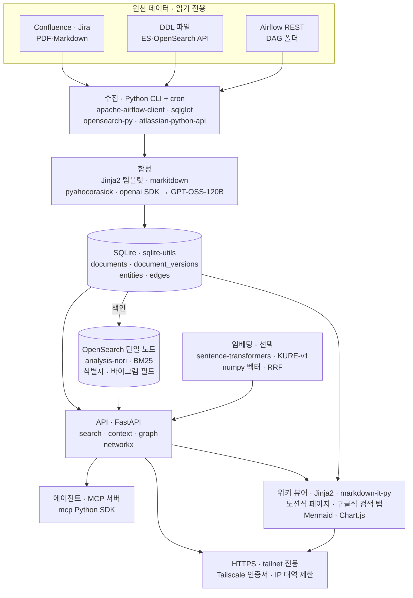
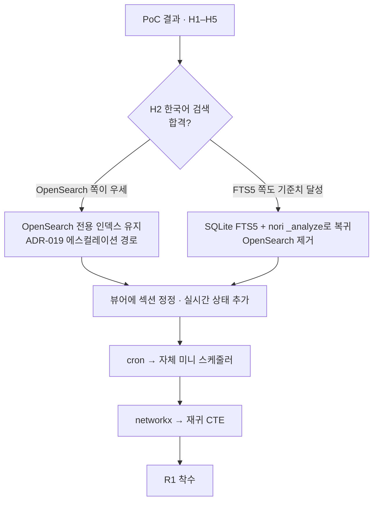
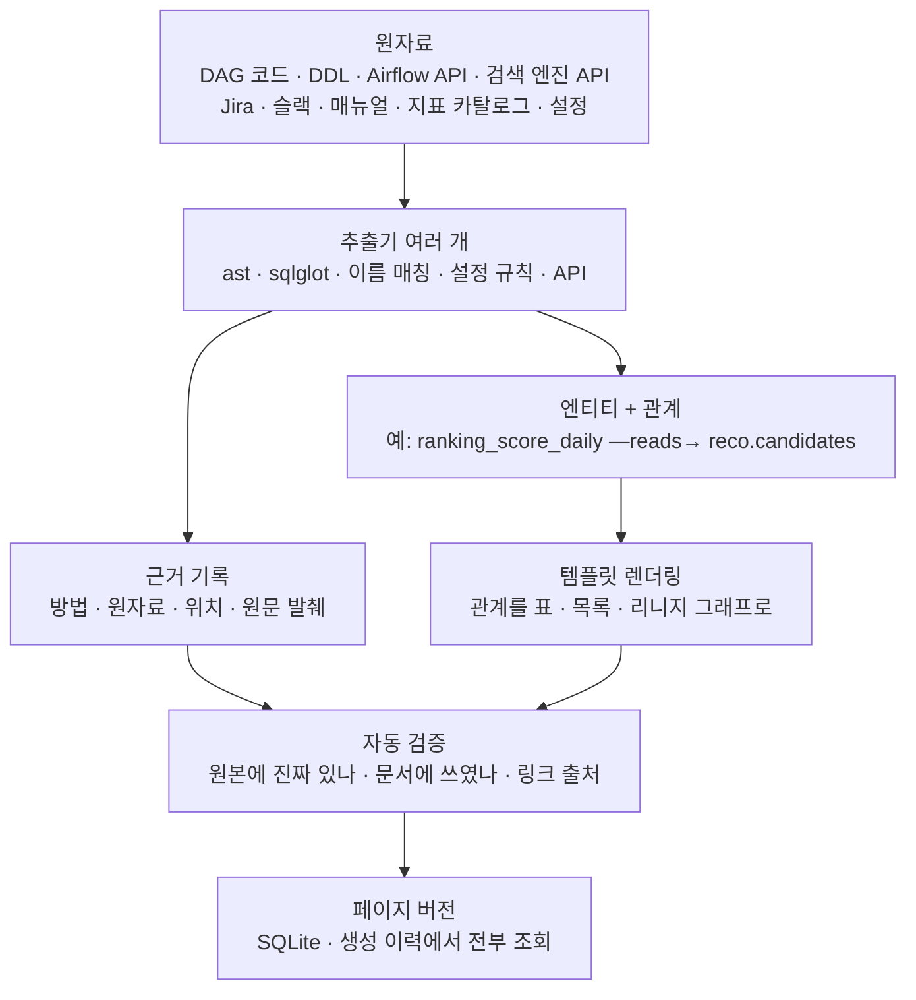
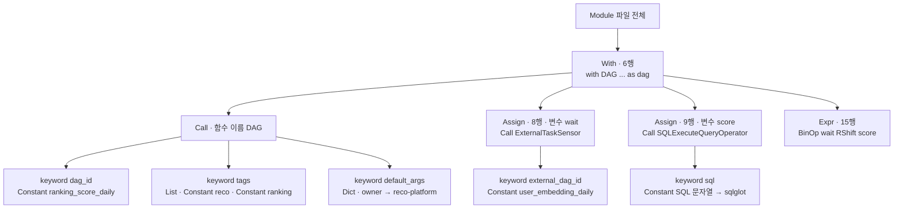
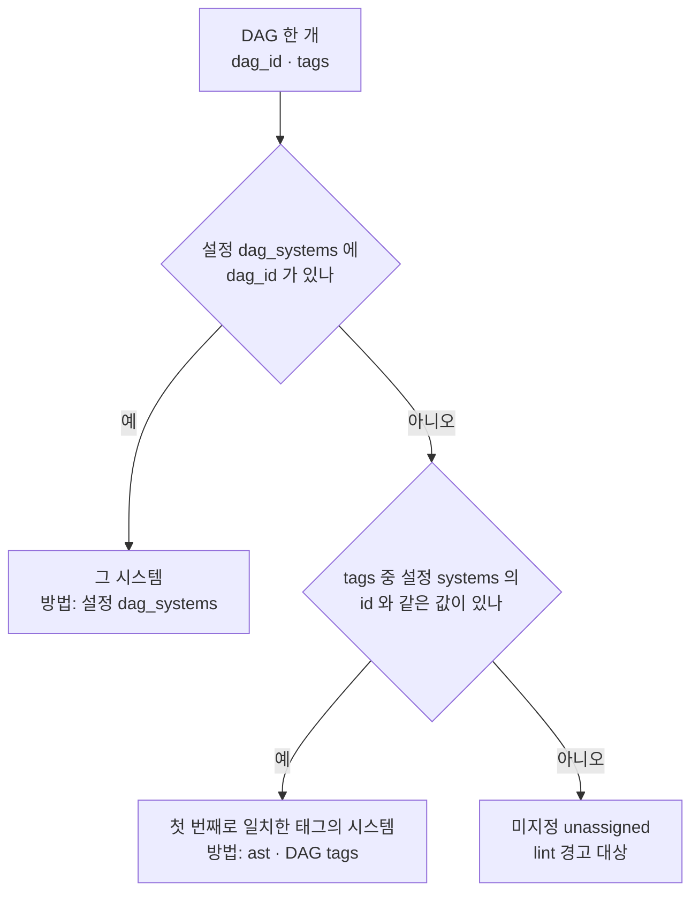
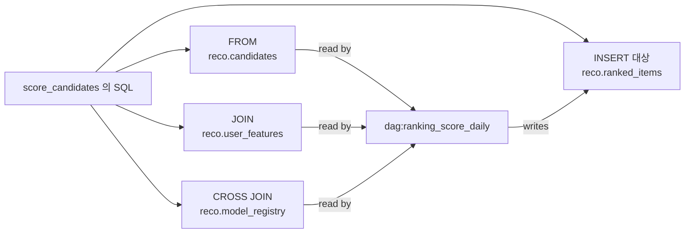
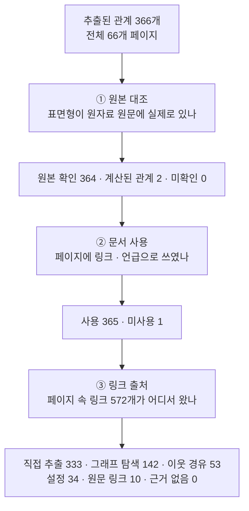

# MVP / PoC 범위와 오픈소스 구성

> 상태: **PoC plan v1** · 담당: huklee · 최종 수정: 2026-09-29 · 결정: [ADR-021](decisions.md#adr-021)

## 1. 한눈에 보기

- **목적**
  - 본 구현(Option A, R1 ≈ 9–11 d) 전에 핵심 가설을 **5–7 영업일** 안에 검증
  - 직접 구현 대신 **오픈소스 최대 활용**
  - 모든 오픈소스는 설계 문서의 인터페이스 뒤에 배치 → 본 구현에서 모듈 단위 교체
- **검증 가설**

| # | 가설 | 합격 기준 |
|---|---|---|
| H1 | 코드·API만으로(LLM 없이) DAG / 테이블 / 인덱스 패밀리 / alias 페이지 생성 가능 | 대상 범위 엔티티의 ≥ 95 % 페이지 생성 · 다운스트림 목록이 수작업 확인과 일치 |
| H2 | nori 기반 한국어 검색이 기준치 달성 | PoC 질의 세트(30–40개, 한국어 ≥ 25개) recall@5 ≥ 0.85 · MRR@10 ≥ 0.7 · 무결과율 < 5 % |
| H3 | 새벽 3시 드릴 시나리오 1–2 해결 | 클릭 ≤ 2번 · < 30 s |
| H4 | GPT-OSS-120B 한국어 서술 품질이 쓸 만함 | 장애 10건 골든 세트 · 인용 검사 통과율 ≥ 90 % · 운영자 평가 "사용 가능" ≥ 7/10 |
| H5 | 에이전트가 호출 한 번으로 장애 대응 컨텍스트 확보 | `context` 도구 1회 호출로 엔티티 · 상태 스냅샷 · 다운스트림 · 알려진 장애 · 런북 반환 |

- **PoC 데이터 범위**
  - 시스템 1개(Reco)
  - DAG ~20개, 테이블 ~50개, 인덱스 패밀리 ~5개
  - 장애 ~10건, 매뉴얼 ~10건
- **결과물의 쓰임**
  - 가설별 합격/불합격 기록 → R1 설계 확정
  - H2 결과로 [ADR-019](decisions.md#adr-019)의 에스컬레이션 여부 결정
    - OpenSearch 인덱스 그대로 유지 vs 본래 설계(SQLite FTS5 + `_analyze`) 복귀

## 2. PoC 구성도



- **흐름 요약**
  - cron이 `opspedia-poc run` 실행 → 수집 → 합성 → SQLite 기록
  - SQLite 문서를 OpenSearch에 색인(nori 토큰 + 벡터)
  - FastAPI 한 프로세스가 검색·컨텍스트 API와 위키 화면(SQLite 직접 렌더링)을 함께 서비스
  - 지표 파이프라인(`metrics-hourly`)이 매시 지표 · 카테고리 페이지만 갱신
- **기존 결정 유지**
  - 기준 원본은 SQLite, git 미사용([ADR-020](decisions.md#adr-020))
    - OpenSearch 인덱스는 파생 데이터, 언제든 재생성
  - LLM 상한 GPT-OSS-120B, LLM 없는 자동화 우선([ADR-018](decisions.md#adr-018))
  - 원천 시스템은 읽기 전용([ADR-016](decisions.md#adr-016))
    - OpenSearch는 PoC 호스트의 **전용 로컬 인스턴스**, 운영 클러스터 쓰기 없음

## 3. 컴포넌트별 커버리지

- 범례
  - ✅ PoC에서 동작 · ◐ 일부 또는 단순화 · — PoC 제외
- 교체 경계
  - 설계 문서의 인터페이스 이름 그대로 사용
  - PoC 코드도 이 경계만 호출 → 본 구현에서 구현체만 교체

### ① 수집 ([01-ingestion](components/01-ingestion.md))

| 기능 | 커버 | PoC 오픈소스 | 교체 경계 | 본 구현 대체 |
|---|---|---|---|---|
| Airflow DAG·태스크 그래프·실행 상태 | ✅ | `apache-airflow-client` | `Connector` | 자체 `airflow_rest` 커넥터(`httpx`) |
| DAG 코드 SQL 파싱 · 테이블 리니지 | ◐ 테이블 단위 | `sqlglot` (lineage) | `Connector` | 같은 `sqlglot` + 컬럼 단위 AST |
| DDL 스캔 | ✅ | `sqlglot` | `Connector` | 유지 |
| 인덱스·alias·매핑·통계 | ✅ | `opensearch-py` / `elasticsearch` | `Connector` | 유지 또는 `httpx` 직접 호출 |
| Confluence · Jira | ◐ 스페이스·프로젝트 1개 | `atlassian-python-api` | `Connector` | 자체 커넥터 |
| PDF · Markdown 매뉴얼 | ✅ | `markitdown` | `Connector` | `pypdfium2` + 자체 변환기 |
| 스케줄러 · 작업 큐 | ◐ cron + 파일 락 | OS cron · `filelock` | CLI `run` | 자체 미니 스케줄러([ADR-010](decisions.md#adr-010)) |
| 의미 기반 해시 · 증분 처리 | ◐ 파일 단위 해시만 | `hashlib` | `ChangeSet` | 의미 기반 해시([ADR-013](decisions.md#adr-013)) |

### ② 합성 ([02-synthesis](components/02-synthesis.md))

| 기능 | 커버 | PoC 오픈소스 | 교체 경계 | 본 구현 대체 |
|---|---|---|---|---|
| 결정적 렌더러(dag, table, index_family, alias, system) | ✅ | `jinja2` · `pydantic` | `TypeSpec` | 유지 |
| 템플릿 요약(LLM 없음) | ✅ | `jinja2` | `Summarizer` | 유지 |
| 엔티티 추출 | ✅ | `pyahocorasick` | `Extractor` | 유지 |
| 장애·매뉴얼 표준화 | ◐ Jira 필드 매핑 + 변환만 | `markitdown` | `Normalizer` | 자체 Confluence 변환기 |
| LLM 서술 + 인용 검사 | ◐ 장애 10건 한정 | `openai` SDK(OpenAI 호환 엔드포인트, `json_schema` 응답 + pydantic 검증 · 1회 재시도) | `LLMClient` | `httpx` 직접 호출 + 처리량 게이트 |
| 청킹 | ✅ | `langchain-text-splitters` | `Chunker` | 자체 헤딩 기반 청커 |
| 임베딩 | ✅ | `sentence-transformers` · KURE-v1 | `Embedder` | 유지([ADR-006](decisions.md#adr-006)) |

### ③ 저장 ([03-storage](components/03-storage.md))

| 기능 | 커버 | PoC 오픈소스 | 교체 경계 | 본 구현 대체 |
|---|---|---|---|---|
| `documents` · `document_versions` | ✅ | SQLite + `sqlite-utils` | `Repository` | 유지(마이그레이션 자체 관리) |
| 키워드 인덱스(한국어) | ✅ | OpenSearch + `analysis-nori` 인덱스 | `SearchIndex` | FTS5 + nori `_analyze` 토큰 컬럼 + 바이그램(H2 결과에 따라 결정) |
| 벡터 저장 · 검색 | ◐ 코드·테스트 완료, 기본 꺼짐 | numpy 전수 코사인 (min 배포본에 k-NN 플러그인 없음) | `VectorIndex` | 유지([ADR-004](decisions.md#adr-004)) |
| 엔티티 · 엣지 | ✅ | SQLite 테이블 | `Repository` | 유지 |
| 백업 · 보관 정책 | — | — | — | `Connection.backup()` |

### ④ 카탈로그 ([04-catalog](components/04-catalog.md))

| 기능 | 커버 | PoC 오픈소스 | 교체 경계 | 본 구현 대체 |
|---|---|---|---|---|
| 트리 | ✅ | 노션식 토글 사이드바(시스템 → 타입 → 엔티티, 상태 이모지) | `TreeResolver` | 유지 |
| 그래프 · 다운스트림 · 영향 범위 | ✅ N홉 | `networkx` | `GraphService` | 재귀 CTE([ADR-012](decisions.md#adr-012)) |
| 인덱스 상태 점검 | ◐ red/yellow · alias 최신성 · 문서 수 감소 | 자체 규칙 몇 개 | `HealthCheck` | 전체 점검 목록 |
| 자동 링크 · 백링크 | ◐ 자동 링크만 | `pyahocorasick` | `Linker` | 백링크 + `[[wiki links]]` |
| 카탈로그 뷰 · lint | — | — | — | M1b · M3 |

### ⑤ 검색 · API ([05-search-api](components/05-search-api.md))

| 기능 | 커버 | PoC 오픈소스 | 교체 경계 | 본 구현 대체 |
|---|---|---|---|---|
| 하이브리드 검색 | ◐ 키워드 기본, 벡터 켜면 RRF | OpenSearch BM25 ⊕ numpy 벡터, Python RRF(k=60) | `Retriever` | 유지 |
| 사용자 사전 · 동의어 | ✅ | nori `user_dictionary_rules` · `synonym_graph` | `Analyzer` 설정 | 사용자 사전 + 자체 쿼리 확장 |
| 패싯 필터 | ◐ type · system만 | OpenSearch filter | `Retriever` | 전체 패싯 |
| `/api/search` · `/api/context` · `/e/{entity}` | ✅ | `fastapi` | REST 계약 | 유지 |
| 한국어 평가 하네스 | ✅ | 지표 직접 계산 (`ranx` 는 x86 macOS 휠 부재로 제외) | `opspedia-poc eval` | 유지 · 질의 80–100개로 확대 |
| 에이전트 도구 | ✅ | `mcp` Python SDK 2.x(`MCPServer`, stdio) | REST 계약 래핑 | 정식 MCP 서버([ADR-015](decisions.md#adr-015)) |
| API 토큰 | ◐ 고정 토큰 1개 | — | 인증 미들웨어 | 해시 저장 · 범위별 토큰 |

### ⑥ 프런트엔드 ([06-frontend](components/06-frontend.md))

| 기능 | 커버 | PoC 오픈소스 | 교체 경계 | 본 구현 대체 |
|---|---|---|---|---|
| 트리 · Markdown 리더 · 코드 · 표 · Mermaid | ✅ | FastAPI + Jinja2 + markdown-it-py(+ mdit-py-plugins · Pygments) · Mermaid JS | 뷰어 모듈 | 유지([ADR-009](decisions.md#adr-009)) |
| 한국어 검색 | ✅ | 검색 페이지 하나(`/search`, `/api/search` 호출) | REST 계약 | ⌘K 팔레트 |
| 엔티티 헤더 · 상태 | ◐ 빌드 시점 스냅샷 + 갱신 시각 | 템플릿 | `TypeSpec` 템플릿 | 요청 시 실시간 조회(60 s 캐시) |
| 섹션 정정 · 리뷰 상태 · 피드백 | — | — | — | R1 · M4 |
| 버전 이력 · diff 화면 | — | — | — | P1 |

### 공통 플랫폼 ([platform](platform.md))

| 기능 | 커버 | PoC 오픈소스 | 본 구현 대체 |
|---|---|---|---|
| HTTPS · tailnet 전용 · 신원 | ◐ 신원 없음 | uvicorn TLS(slk-bridge 의 Tailscale 인증서 재사용) + tailnet IP 대역 제한 | TLS 관리자 + `whois`([ADR-011](decisions.md#adr-011)) |
| OpenSearch 실행 | ✅ | 공식 min tarball + Temurin JDK 21(`.runtime/`, 단일 노드, localhost 바인딩) | 제거 또는 유지(H2 결과) |
| 설정 | ✅ | `pyyaml` + `pydantic-settings` | 유지 |
| 관측성 · 백업 | — | 로그 파일만 | `/healthz` · `/metrics` · 백업 |

## 4. 오픈소스 목록과 라이선스

- 전부 상업적 사용 가능한 허용형 라이선스
- 도입 전 버전별 라이선스 재확인, 모델은 모델 카드 확인

| 오픈소스 | 용도 | 라이선스 |
|---|---|---|
| OpenSearch + `analysis-nori` | nori BM25 · `_analyze` | Apache-2.0 |
| markdown-it-py · mdit-py-plugins · Pygments | Markdown 렌더링 · callout · 코드 하이라이트 | MIT · MIT · BSD-2 |
| Mermaid · Chart.js (CDN) | 리니지 그래프 · 지표 차트 | MIT · MIT |
| FastAPI | API · 정적 사이트 서비스 | MIT |
| `mcp` Python SDK | 에이전트 도구 서버 | MIT |
| `sqlglot` | SQL · DDL 파싱, 리니지 | MIT |
| `apache-airflow-client` | Airflow REST | Apache-2.0 |
| `opensearch-py` | 검색 엔진 API | Apache-2.0 |
| `atlassian-python-api` | Confluence · Jira | Apache-2.0 |
| `markitdown` | PDF · HTML · Office → Markdown | MIT |
| `sqlite-utils` | SQLite 스키마 · upsert | Apache-2.0 |
| `pyahocorasick` | 엔티티 추출 · 자동 링크 | BSD-3 |
| `networkx` | 그래프 탐색 · 영향 범위 | BSD-3 |
| `sentence-transformers` + KURE-v1 | 한국어 임베딩 | Apache-2.0 · 모델 카드 확인 |
| `langchain-text-splitters` | 청킹 | MIT |
| `openai` SDK | GPT-OSS-120B 호출 · 구조화 출력 | Apache-2.0 |
| `jinja2` · `pydantic` · `filelock` | 템플릿 · 스키마 · 워커 락 | BSD-3 · MIT · Unlicense |

## 5. 교체 원칙

- **인터페이스 우선**
  - PoC 첫날 설계 문서의 인터페이스(`Connector`, `Repository`, `SearchIndex`, `VectorIndex`, `Retriever`, `Embedder`, `LLMClient`, `GraphService`)를 `typing.Protocol`로 먼저 정의
  - 오픈소스 호출은 어댑터 모듈 하나(`opspedia/adapters/<oss>.py`) 안에만 위치
  - 비즈니스 로직에서 오픈소스 직접 import 금지(`ruff` banned-api 규칙으로 강제)
- **데이터는 SQLite에**
  - OpenSearch 인덱스는 파생 데이터
  - 어댑터 교체 시 `opspedia rebuild` 하나로 새 구현체에 재색인
- **계약 고정**
  - REST 응답 스키마(`/api/search`, `/api/context`)와 frontmatter 스키마는 본 구현과 동일
  - UI · MCP · 에이전트는 백엔드 교체와 무관하게 유지
- **교체 순서(본 구현)**



- **보충:** H2 판정 방법
  - 같은 질의 세트로 비교군 2개 측정
    - A: OpenSearch nori 인덱스
    - B: SQLite FTS5 + `_analyze` nori 토큰 + 바이그램(PoC 마지막 날 스파이크)
  - 두 쪽 모두 기준치 달성 시 운영 부담이 적은 B 선택
  - B만 미달 시 A 유지, 운영 대상 서비스 +1 기록

## 6. 일정 (5–7 영업일)

| 일차 | 작업 | 확인 가설 |
|---|---|---|
| D1 | 인터페이스 정의 · 설정 · SQLite 스키마 · 로컬 OpenSearch(nori) · TLS | — |
| D2 | 커넥터: Airflow REST · DDL · 인덱스 API · sqlglot 리니지 → 엔티티 · 엣지 | H1 |
| D3 | 렌더러(dag, table, index_family, alias, system) · 뷰어 · 상태 점검 | H1 · H3 |
| D4 | OpenSearch 색인(nori + 사용자 사전 + 동의어 + KURE-v1) · `/api/search` · 검색 페이지 · 평가 | H2 |
| D5 | `/api/context` · networkx 영향 범위 · MCP 도구 · 드릴 시나리오 1–2 | H3 · H5 |
| D6 | Jira · markitdown 표준화 · GPT-OSS-120B 서술 + 인용 검사(장애 10건) | H4 |
| D7 | 비교군 B 스파이크(FTS5 + `_analyze`) · 결과 보고서 · R1 설계 반영 | H2 |

- D6은 GPT-OSS-120B 엔드포인트(Q5) 확보 시에만 진행
  - 미확보 시 H4 보류, D6은 버퍼
- 결과 보고서 위치: `docs/poc-report.md`(가설별 수치 · 스크린샷 · 결정)

## 7. PoC 제외 항목

- 섹션 정정, 리뷰 상태, 피드백, 리뷰 큐
- 버전 이력 · diff 화면(데이터는 `document_versions`에 기록)
- 요청 시 실시간 상태 조회(스냅샷 + 갱신 시각만)
- 컬럼 단위 리니지, 템플릿 · 수명 주기 정책 페이지
- 다중 클러스터 · 다중 Airflow, 백업, `/metrics`
- 모든 쓰기 동작(원천 시스템 대상)

## 8. 확인이 필요한 질문 (PoC 추가분)

- 기존 Q1–Q15는 [overview.md](overview.md#확인이-필요한-질문) 참고, PoC를 막는 질문은 Q1 · Q2 · Q3 · Q15
- 추가 질문

| # | 질문 | 답이 없을 때 기본값 |
|---|---|---|
| P1 | PoC 호스트에 컨테이너 런타임(Docker · OrbStack · Colima) 사용 가능? | 컨테이너 없이 공식 tarball + 사용자 영역 JDK (이 Mac mini: Docker 없음, Homebrew 는 소스 빌드) |
| P2 | 원천 데이터 사본을 PoC 호스트의 로컬 OpenSearch에 색인해도 되나? | 가능(tailnet 전용 호스트, 외부 반출 없음) |
| P3 | PoC 대상 시스템 · 범위 | Reco 시스템, DAG ~20개 |
| P4 | 드릴 · 서술 품질 평가 참여 운영자 | 2명, 각 1시간 |

## 9. 구현 현황 (2026-09-29, dummy 데이터, 2차)

- 위치: [`poc/`](../poc/README.md) · 서버 `serve` (기본 :8443, tailnet 전용)
- 이야기 버전: [poc-story.md](poc-story.md)

### 9.1 범위에 추가된 것 (2차 요청 반영)

- **위키 화면**: MkDocs → FastAPI + Jinja2 자체 뷰어로 교체
  - 이유: 최근 본 페이지 · 최근 업데이트 · 실행 이력 · 지표 차트 같은 동적 화면 필요
  - 노션 벤치마크: 토글 사이드바, 페이지 이모지 아이콘, 속성(property) 블록, callout, 다크 모드 자동
  - 구글 벤치마크: 항상 상단에 있는 검색창(자동완성 · `⌘K`), 결과 탭(전체 · DAG · 테이블 · 인덱스 · 장애 · 런북 · 지표 · 기타), 경로 표시 · 강조 스니펫, 지식 패널
- **홈**: 최근 본 페이지(브라우저 저장), 지금 확인이 필요한 항목, 최근 업데이트, 중요 지표 카테고리(스파크라인)
- **관리자**: 잡 3종 · 실행 이력 · 실행 상세(단계 폭포수 · LLM 서술 결과 · 문서별 바뀐 섹션) · 페이지별 버전 diff와 "이 페이지가 만들어지는 방식"
- **서비스 중요 지표**: 카테고리 4개(추천 품질 · 파이프라인 SLA · 검색 인덱스 건강도 · 검색 품질) · 지표 12개
  - 지표 파이프라인 `metrics-hourly`: Prometheus `query_range` 형태 수집 → 7일 평균 · 변화율 → SLO 판정 → 3σ 이상 탐지 → 지표 · 카테고리 페이지 → 재색인
- **런북**: 7개로 확대 · 심각도 표, 첫 5분, 진단 명령, 원인별 분기, 복구 · 검증 · 롤백, 에스컬레이션, 공지 템플릿
- **실행 이력 재현** (`seed-history`): 지난 1주 24회 실행을 **실제 파이프라인으로** 재생
  - 시점별 dummy 스냅샷(DDL 컬럼 추가, 랭킹 SQL 변경, 신규 DAG, 런북 개정, Jira 신규 장애)
  - Confluence 커넥터 타임아웃 → 마지막 정상 스냅샷 재사용(`partial`) 사례 포함
  - mock LLM(GPT-OSS-120B 대역, 화면에 명시): 장애 5건 중 4건 인용 통과, 1건 인용 없는 문장으로 거절 → 템플릿 요약 유지

### 9.2 가설별 결과

| # | 결과 | 근거 |
|---|---|---|
| H1 | ✅ 엔티티 65개 전부 페이지 · 엣지 170개 | 재실행 시 변경 0건(멱등) · 상태 스냅샷만 바뀐 실행은 0–2개 페이지만 갱신 |
| H2 | ⚠️ **미확정** | 코퍼스가 풍부해지자 3개 비교군 중 1개만 기준 통과 (아래) |
| H3 | ✅ 드릴 1–2 | 홈 "지금 확인이 필요한 항목" → 페이지 1번 클릭 · 페이지에 다운스트림 · 알려진 장애 · 런북 |
| H4 | ◐ 흐름만 검증 | mock LLM 으로 인용 검사 통과 · 거절 경로 확인, 실제 GPT-OSS-120B 품질은 엔드포인트 확보 후 |
| H5 | ✅ | `/api/context` · MCP `context` 도구 1회 호출 |

### 9.3 H2 측정값 변화 (질의 34개, 한국어 28개)

| 비교군 | 1차 (문서 47개) | 2차 · 문서 단위 (65개) | 2차 · 섹션 청크 (최종) |
|---|---|---|---|
| A: OpenSearch nori | 0.882 / 0.768 ✅ | 0.794 / 0.690 ❌ | 0.779 / 0.696 ❌ |
| B: FTS5 + nori `_analyze` + 바이그램 | 0.873 / 0.746 ✅ | 0.843 / 0.727 ❌ | **0.858 / 0.722 ✅** |
| 바이그램 단독 | 0.873 / 0.746 ✅ | 0.828 / 0.723 ❌ | 0.814 / 0.682 ❌ |

- 값: recall@5 / MRR@10 · 무결과율은 모두 0 %
- **해석**
  - 긴 런북 · 지표 페이지가 들어오자 "장애", "대응" 같은 일반어가 긴 문서 쪽으로 쏠림
  - 설계대로 섹션 청크 색인 → 문서 단위 묶기 적용 시 B 만 기준 회복
  - 실패 질의 상당수는 정답 자체가 모호("장애 대응 가이드" ↔ 런북 7개 전부 해당) → 평가 세트 라벨링 기준도 과제
  - dummy 세트로 A/B 우열 판단 불가 → **실데이터 · 운영자 질의 80–100개로 재측정 필수**
- **테스트**: `uv run pytest` 34개 통과 (OpenSearch 없이)
- **설계와 달라진 점**
  - 뷰어: MkDocs → 자체 뷰어 (ADR-009 방향과 동일, 시점만 앞당김)
  - OpenSearch k-NN 대신 numpy 벡터 · `ranx` · `instructor` · `tailscale serve` 미사용
  - dummy 커넥터는 API 응답 형태의 파일을 읽음 → 실 API 클라이언트는 실데이터 연결 단계에서 도입
- **다음 단계**
  - 실제 Airflow · ES · Jira 읽기 전용 연결 (Q1 · Q2 · Q4)
  - 운영자 질의 수집 → H2 재판정 (A/B 중 선택, ADR-019 에스컬레이션 여부)
  - GPT-OSS-120B 엔드포인트 확보 → H4 골든 세트
  - KURE-v1 임베더 켜고 하이브리드 재평가

## 10. 3차 반영 (2026-09-29)

- **LLM 구성**: 요청 모델은 항상 **GPT-OSS-120B**(사내 OpenAI 호환, 환경변수 `GPT_OSS_BASE_URL`)
  - 이 호스트(Apple M2 · 메모리 8 GB)에서는 120B(약 65 GB) 실행 불가 · 사내 엔드포인트 미확보(Q5)
  - 그래서 엔드포인트 미설정 시 **대역 모델**(로컬 Ollama `qwen2.5:3b`)로 처리, 생성 이력에 "요청 gpt-oss-120b → 실제 qwen2.5:3b · 사유"를 그대로 기록
  - `GPT_OSS_BASE_URL` 만 설정하면 코드 변경 없이 GPT-OSS-120B 로 전환, 결과 캐시는 (모델, 프롬프트, 스키마) 해시 단위
- **자연어 질의 검색** ([nl-search.md](nl-search.md)): 규칙 해석 + LLM 재작성 → recall@5 0.688 → 0.847, 담당 · 상태 · 영향 질문은 구조화 사실로 답(환각 방지)
- **장애 원자료 합성** ([incident-synthesis.md](incident-synthesis.md)): Jira · 알림 · 슬랙 · 포스트모템 → 근거 조각 → 결정적 추출 → LLM 구조화(인용 필수) → 검증 → 병합 → 지식, 화면 생성 이력 `/e/incident:<키>/history#synthesis`
- **생성 이력 강화** (`/e/<엔티티>/history`)
  - 단계별 소요: 실행 단계(수집 · 합성 · 저장 · 색인) + 이 문서 렌더링 · LLM · 장애 6단계
  - 원본 데이터: 이 버전을 만든 원자료 원문(내용 주소 `raw_versions`), 추출된 표면형 강조
  - **엔티티 추출 추적**: 관계마다 추출 방법(sqlglot 리니지 · ast · 레지스트리 매칭 · 설정 · API) · 원본 위치(파일:줄 · 근거 조각) · 원문 발췌 · **원본에 실제로 있는지** · **문서에 실제로 쓰였는지**(링크 · 언급 · 섹션) · 문서 속 링크 출처(직접 · 그래프 · 이웃 경유 · 설정 · 원문 링크 · 근거 없음)
  - 현재 전체 문서(66개) 기준: 추출 관계 366개 중 원본 확인 364 · 계산 2 · 미확인 0, 문서 사용 365(언급 포함), 문서 속 링크 572개 중 **근거 없는 링크 0**
- **수동 업로드** (`/admin/upload`): txt · html · Confluence storage XML · md → **자체 정적 변환기** → 미리보기(DB 쓰기 없음, 변환 통계 · 경고 · 엔티티 원본 대조) → 반영(파이프라인 실행) → 삭제(DB 흔적까지 제거)
  - 데모 3종(`dummy/upload_samples/`)으로 반영 · 추적 · 삭제 사전 검증 완료, 검증 후 DB 에서 전부 제거(문서 66 → 66)
- **엔티티별 되돌리기(undo)**: 최신 버전을 직전 내용으로 복원(v1 이면 삭제), 원인 원자료(해시)를 **차단**하면 다음 수집에서 직전 원자료로 대체 → 잘못된 수집이 다시 반영되지 않음. 차단 목록 · 해제는 관리자 화면
- **분류기 · 파서 재사용 시나리오** 조사: [synthesis-scenarios.md](synthesis-scenarios.md)
- **UI**: 왼쪽 패널 이모지 제거(상태는 색 점)
- **범위 축소**: 합성 결과 검증 화면 제거 · 장애 합성 과정 화면은 생성 이력에 통합
- **테스트**: 41개 통과 (Ollama · OpenSearch 없이)

## 11. 지식 합성 쉽게 보기

### 11.1 한 줄 요약

- **원자료(코드 · API · 문서)에서 "무엇이 무엇과 어떻게 이어져 있나"를 규칙으로 뽑고, 뽑을 때마다 영수증(근거)을 남긴 뒤, 그 관계로 페이지를 씀**
- 비유
  - 원자료 = 재료, 엔티티 = 명사(DAG · 테이블 · 인덱스 · 팀), 관계(엣지) = "A 가 B 를 읽음" 같은 문장 뼈대
  - 템플릿 = 문장 틀, 페이지 = 완성본, 근거 = 문장마다 붙은 영수증
- LLM 은 영수증이 붙은 재료 안에서 **서술만** 보탬 (장애 요약 등, §9 · [incident-synthesis.md](incident-synthesis.md))



### 11.2 추출 방법 한눈에

| 추출 방법 (생성 이력 표기) | 읽는 것 | 뽑는 것 | 원리 한 줄 | 실제 예 (ranking_score_daily) |
|---|---|---|---|---|
| `ast · DAG(...)` | DAG 파이썬 코드 | dag_id · 스케줄 · 재시도 | 코드를 **실행하지 않고** 문법 트리에서 `DAG(...)` 호출의 인자 값만 읽음 | `dag_id="ranking_score_daily"` · `schedule="0 5 * * *"` |
| `ast · DAG tags` | 같은 호출의 `tags=[...]` | 소속 **시스템** | 태그 목록 중 설정의 시스템 id 와 같은 첫 값 (§11.4) | `tags=["reco", "ranking"]` → `system:reco` |
| `ast · DAG default_args.owner` | `default_args={"owner": ...}` | 담당 **팀** | 딕셔너리 리터럴의 `owner` 값 = 팀 id | `"owner": "reco-platform"` → `team:reco-platform` |
| `ast · ExternalTaskSensor(태스크)` | 센서 오퍼레이터 호출 | DAG 간 **의존** | `external_dag_id=` 값 = 기다리는 업스트림 DAG | `wait_embeddings` → `dag:user_embedding_daily` |
| `ast · IndexBuildOperator` · `AliasSwapOperator` | 인덱스 빌드 · 전환 오퍼레이터 | **빌드 · 전환** 관계 | `index_family=` · `alias=` · `source_table=` 값 | (reco_feed_publish) `index_family="reco-feed"` |
| `ast · >>` | `wait >> score` 구문 | 태스크 **순서** | 비트 시프트 연산자 체인을 왼쪽 → 오른쪽으로 펼침 | `wait_embeddings → score_candidates` |
| `sqlglot 리니지 · INSERT 대상` | 태스크의 `sql=` 문자열 | **쓰는** 테이블 | SQL 을 구문 트리로 파싱, `INSERT` 대상 테이블 (§11.5) | `reco.ranked_items` |
| `sqlglot 리니지 · FROM/JOIN` | 같은 SQL | **읽는** 테이블 | 나머지 모든 테이블 참조 − 쓰기 대상 − CTE 이름 | `reco.candidates` · `reco.user_features` · `reco.model_registry` |
| `sqlglot DDL` | `CREATE TABLE` 파일 | 컬럼 · 파티션 · 설명 | DDL 구문 트리의 컬럼 정의 · `COMMENT` · `PARTITIONED BY` | (reco.users) `segment STRING` |
| `규칙 · 스키마 접두사` | 테이블 이름 | 테이블의 시스템 | `reco.` → reco, `logs.` · `search.` → search (설정 `schema_systems`) | `reco.ranked_items` → `system:reco` |
| `설정 dag_systems` · `index_families` · `systems.team` | `config.yaml` | 태그로 안 되는 소속 · 인덱스 패밀리 · 시스템 담당 | 사람이 적은 설정이 규칙보다 우선 | `product_index_build: search` |
| `검색 엔진 API · _alias` | `_cat/indices` · `_alias` 응답 | alias → 실제 인덱스 | API 응답 JSON 필드 그대로 | `"reco-feed": "reco-feed-2026.09.28"` |
| `지표 카탈로그 producer` | `catalog.yaml` | 지표 ↔ 산출 DAG · 테이블 | 카탈로그에 적힌 `producer` 목록 | (reco_ctr) `dag:ctr_report_daily` |
| `레지스트리 이름 매칭 (Aho–Corasick)` | 매뉴얼 · Jira 본문 | 문서가 **언급**한 엔티티 | 등록된 이름 전부를 한 번에 찾는 사전 검색 (§11.6) | 런북 3개가 `ranking_score_daily` 언급 |
| `레지스트리 매칭 · 근거 조각 E#` | 장애 원자료 묶음 | 장애의 **영향** 엔티티 | 같은 이름 매칭을 근거 조각 단위로 → 조각 id 가 영수증 | INC-2341 `E6 알림` |

### 11.3 `ast` 의 원리 — 코드를 실행하지 않고 읽기

- **ast(Abstract Syntax Tree, 추상 구문 트리)**
  - 파이썬이 코드를 실행하기 전에 만드는 "문장 구조도"
  - 표준 라이브러리 `ast.parse(코드)` 한 줄로 얻음 → 트리의 노드를 돌며 필요한 부분만 읽음
- **왜 실행하지 않나**
  - Airflow 설치 · DAG 임포트 불필요 (DAG 코드가 DB 접속 · 외부 호출을 해도 안전)
  - 수백 개 DAG 를 밀리초 단위로 읽음 · 운영 Airflow 에 부하 없음
- **원본 코드** (`dummy/dags/ranking_score_daily.py`)

```python
 6  with DAG(dag_id="ranking_score_daily", schedule="0 5 * * *", tags=["reco", "ranking"],
 7           default_args={"owner": "reco-platform", "retries": 2}) as dag:
 8      wait = ExternalTaskSensor(task_id="wait_embeddings", external_dag_id="user_embedding_daily")
 9      score = SQLExecuteQueryOperator(task_id="score_candidates", sql="""
10          INSERT OVERWRITE TABLE reco.ranked_items PARTITION (dt='{{ ds }}')
11          SELECT c.user_id, rank_items(c.items, f.clicks_7d, m.version) AS top50
12          FROM reco.candidates c JOIN reco.user_features f ON c.user_id = f.user_id
13          CROSS JOIN reco.model_registry m
14      """)
15      wait >> score
```

- **파이썬이 보는 모양** (`ast.dump` 결과를 줄인 트리)



- **파서가 하는 일** (`connectors/__init__.py` `parse_dag_file`)
  1. `ast.parse` → 트리 생성
  2. `ast.walk` 로 모든 노드 방문
  3. 이름이 `DAG` 인 **Call** 노드 → keyword 마다 `ast.literal_eval` 로 **리터럴 값만** 꺼냄 (dag_id · schedule · tags · default_args)
  4. `task_id=` 가 있는 **Assign** 노드 = 태스크 · 오퍼레이터 이름(`ExternalTaskSensor` 등) · 줄 번호 · `sql=` · `external_dag_id=` · `index_family=` 등
  5. `>>` **BinOp** 체인 → `[wait, score]` → 변수 이름을 task_id 로 바꿔 순서 목록
  6. `sql=` 문자열은 §11.5 의 sqlglot 으로 넘김
- **결과** (이 파일 하나에서)

| 뽑힌 값 | 트리 위치 | 만들어진 관계 |
|---|---|---|
| `dag_id = ranking_score_daily` | DAG Call · keyword | 엔티티 `dag:ranking_score_daily` |
| `tags = [reco, ranking]` | DAG Call · keyword · List | `part_of → system:reco` (§11.4) |
| `owner = reco-platform` | default_args Dict | `owned_by → team:reco-platform` |
| `external_dag_id = user_embedding_daily` | Assign 8행 · keyword | `depends_on → dag:user_embedding_daily` |
| `sql = INSERT ... FROM ...` | Assign 9행 · keyword | `writes` 1 · `reads` 3 (§11.5) |
| `wait >> score` | Expr 15행 | 태스크 순서 `wait_embeddings → score_candidates` |

- **한계**
  - `literal_eval` 은 리터럴만 읽음 → 태그 · dag_id 를 변수 · 함수 · 반복문으로 만드는 **동적 DAG** 는 값이 비어 추출 실패
  - 대응: Airflow REST API(`/api/v1/dags`)의 실제 등록 정보로 보완(태스크 그래프 · 태그 · 소유자), 불일치는 lint 대상

### 11.4 `DAG tags` 의 원리 — 이미 달려 있는 태그로 소속 정하기

- **tags 는 무엇**
  - Airflow DAG 의 `tags=[...]` 인자, 원래 Airflow UI 에서 DAG 를 거르는 용도
  - 팀들이 이미 붙여 쓰는 메타데이터 → **코드 수정 없이** 시스템 소속으로 재사용
- **결정 규칙** (위에서부터 먼저 맞는 것)



- **예시**

| DAG | tags | 설정 dag_systems | 결정 | 생성 이력 표기 |
|---|---|---|---|---|
| ranking_score_daily | `reco`, `ranking` | 없음 | `system:reco` (`reco` 가 시스템 id) | `ast · DAG tags` · 원문 `"reco"` · 6행 |
| feature_store_daily | `reco`, `feature` | 없음 | `system:reco` | `ast · DAG tags` |
| product_index_build | `search`, `index` | `search` | `system:search` (설정 우선) | `설정 dag_systems` |
| (가상) tmp_job | `adhoc` | 없음 | 미지정 | lint 경고 |

- `ranking` · `feature` 처럼 시스템 id 가 아닌 태그는 무시 (페이지의 태그 칩으로만 표시)
- **owner 도 같은 방식**: `default_args.owner` 값이 설정 `teams` 의 id 와 같으면 담당 팀, 다르면 "담당 미지정"
- **한계와 대응**
  - 태그 오타 · 누락 → 미지정 페이지 → lint 로 드러내고 `dag_systems` 설정으로 보정
  - 한 DAG 에 시스템 태그가 둘이면 첫 번째 채택 → 순서 의존 → 다중 소속이 필요해지면 규칙 변경

### 11.5 `sqlglot` 리니지의 원리 — SQL 에서 읽기 · 쓰기 테이블 가르기

- SQL 문자열을 방언(Hive)에 맞춰 구문 트리로 파싱 → 테이블 참조 노드를 모두 수집
  - `INSERT` 의 대상 = **쓰기(writes)**
  - 그 밖의 테이블 = **읽기(reads)**, 단 `WITH` 로 만든 임시 이름(CTE)은 제외
- `{{ ds }}` 같은 Airflow 템플릿은 따옴표 안 문자열이라 파싱에 영향 없음



- 이 관계들이 모이면 DAG → 테이블 → DAG → 인덱스 로 이어지는 **리니지 그래프** · **다운스트림 3홉** 표가 됨
- 한계: 파이썬에서 문자열을 이어 붙여 만드는 SQL · 저장 프로시저 내부는 못 읽음 → 컬럼 단위 · 런타임 리니지(OpenLineage 등)는 이후 과제

### 11.6 이름 매칭(Aho–Corasick)의 원리 — 문서가 언급한 엔티티 찾기

- 레지스트리(이미 만든 DAG · 테이블 · 인덱스 이름) 전부를 **사전 하나**로 만들고 문서를 **한 번만** 훑어 동시에 찾음
  - 이름이 수천 개여도 문서 길이에 비례하는 시간
- **경계 규칙**: 앞 글자가 영숫자 · 밑줄이거나 뒤 글자가 영숫자면 제외
  - `new_products` 안의 `products` → 앞이 밑줄이라 제외
  - `products_v42` 안의 `products` → 뒤가 밑줄이라 허용 (인덱스 패밀리 → 실제 인덱스 이름을 잡기 위해 의도)
  - 한계: 같은 규칙 때문에 `ranking_score_daily_v2` 도 `ranking_score_daily` 로 잡힘 → 이런 이름이 생기면 "가장 긴 이름 우선" 규칙 추가 필요 · 사람 검토 흐름은 범위에서 제외(3차 다이어트)
- **예**: 런북 "랭킹 배치 OOM 대응" 5행 `ranking_score_daily 의 score_candidates 태스크가 …` → `runbook:ranking-oom —mentions→ dag:ranking_score_daily`
- 장애 원자료에서는 근거 조각(E1…) 단위로 매칭 → 조각 id 가 그대로 영수증

### 11.7 영수증(근거)과 3단 자동 검증

- 관계 하나를 만들 때마다 기록: **방법 · 원자료(소스 / 키 / 내용 해시) · 위치(파일:줄 또는 근거 조각) · 원문 발췌 · 표면형(찾은 글자)**
- 페이지를 만든 뒤 자동 검증 3가지 (생성 이력 "엔티티 추출 추적")



- **ranking_score_daily 페이지 한 장의 실제 추적** (관계 14개 모두 원본 확인 · 모두 사용)

| 방향 | 관계 | 상대 엔티티 | 방법 | 위치 | 문서 사용 |
|---|---|---|---|---|---|
| → | owned_by | 추천 플랫폼팀 | ast · DAG default_args.owner | 7행 | 링크 · 개요 |
| → | part_of | Reco 추천 시스템 | ast · DAG tags | 6행 | 링크 · 개요 |
| → | depends_on | user_embedding_daily | ast · ExternalTaskSensor | 8행 | 언급 · 리니지 · 태스크 |
| → | writes | reco.ranked_items | sqlglot · INSERT 대상 | 10행 | 링크 · 다운스트림 |
| → | reads | reco.candidates 외 2 | sqlglot · FROM/JOIN | 12–13행 | 언급 · 태스크 |
| ← | depends_on | reco_feed_publish | ast · ExternalTaskSensor (상대 DAG 코드) | reco_feed_publish 8행 | 링크 · 다운스트림 |
| ← | mentions | 런북 3개 | 이름 매칭 | 각 런북 줄 | 링크 · 런북 |
| ← | affected | INC-2198 · 2291 · 2341 | 이름 매칭 (Jira · 근거 조각) | INC-2341 `E6 알림` 등 | 링크 · 알려진 장애 |

- **판정 기준과 한계**
  - 원본 대조 = 표면형 문자열 포함 여부 (대소문자 무시) · 위치는 첫 등장 줄
  - 문서 사용 = 링크 또는 이름 언급 · `reco` 처럼 짧은 이름은 언급 판정이 넓게 잡힘
  - "계산된 관계"(영향 엔티티 겹침으로 찾은 유사 장애)는 표면형이 없어 원본 대조 대신 계산 근거로 표시
