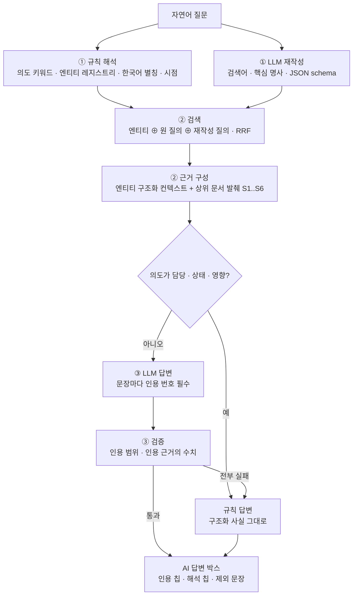

# 자연어 질의 검색 (AI 답변)

> 상태: **PoC 구현** · 2026-09-29 · 코드 `poc/opspedia_poc/ask.py` · API `/api/ask?q=` · 화면 검색 결과 상단 "AI 답변"
> 모델: PoC 로컬 Ollama `qwen2.5:3b` (OpenAI 호환) → 본 구현 GPT-OSS-120B, 설정 `ask:` 만 변경

## 1. 한눈에 보기

- **목적**: "오늘 추천 피드가 왜 안 바뀌었어?" 같은 문장형 질문에 인용 달린 짧은 답
- **원칙**: 규칙으로 답할 수 있는 질문은 규칙으로, LLM 은 검색어 재작성과 서술만 (ADR-018)
- **결과 (자연어 질의 12개, dummy)**

| 검색 방식 | recall@5 |
|---|---|
| 키워드만 (기존 검색) | 0.688 |
| + 규칙 기반 엔티티 · 의도 | 0.806 |
| + LLM 검색어 재작성 | **0.847** |

- 답변: 핵심어 적중 92 % · LLM 인용 검증 통과 8 · 규칙 답변 3 · 일부 문장 제외 1 · p50 2.3초
- 핵심어 적중은 느슨한 지표 → 서술 충실도는 3B 에서 들쭉날쭉 (예: 원인 질문에 증상 위주 서술)

## 2. 흐름

## 3. 단계별

- **① 해석**
  - 규칙: 의도 7종(원인 · 담당 · 절차 · 상태 · 영향 · 정의 · 지표) 키워드, 엔티티 이름 · 장애 키 · 한국어 별칭(`추천 피드` → `index:reco-feed`)
  - LLM: `{intent, keywords[], rewritten}` — 규칙 의도가 있으면 규칙 우선
- **② 검색 · 근거**
  - 세 결과 목록(엔티티, 원 질의, 재작성 질의)을 RRF 로 결합
  - 엔티티가 잡히면 `/api/context` 와 같은 구조화 사실(상태 · 점검 · 온콜 · 다운스트림 · 장애 · 런북)을 첫 근거로
  - 원인 질문: 문제 있는 업스트림과 연결 장애의 근본 원인을 근거 앞쪽에 배치
- **③ 답변 · 검증**
  - 담당 · 상태 · 영향: LLM 없이 구조화 사실로 답 — 3B 가 담당자를 지어낸 사례가 있어 규칙으로 전환
  - 그 외: `{sentences: [{cites: [1, 3], text}]}` 스키마, 인용이 문장보다 앞
  - 검증: 인용 번호 범위, 문장 속 수치가 인용 근거에 있는지 → 실패 문장은 제외 표시, 전부 실패면 규칙 답변
- **화면**
  - 키워드 결과는 즉시, AI 답변은 비동기(평균 2–8초)로 상단에
  - 문장형 질문이면 자동 실행, 키워드 질문이면 "AI 답변 보기" 버튼

## 4. 다음 단계

- GPT-OSS-120B 로 교체 후 같은 12문항 + 운영자 질문 30개로 서술 충실도 평가(사람 판정)
- 의도별 규칙 답변 확대(지표 질문 → 지표 카드), 질문 로그를 평가 세트로 누적
