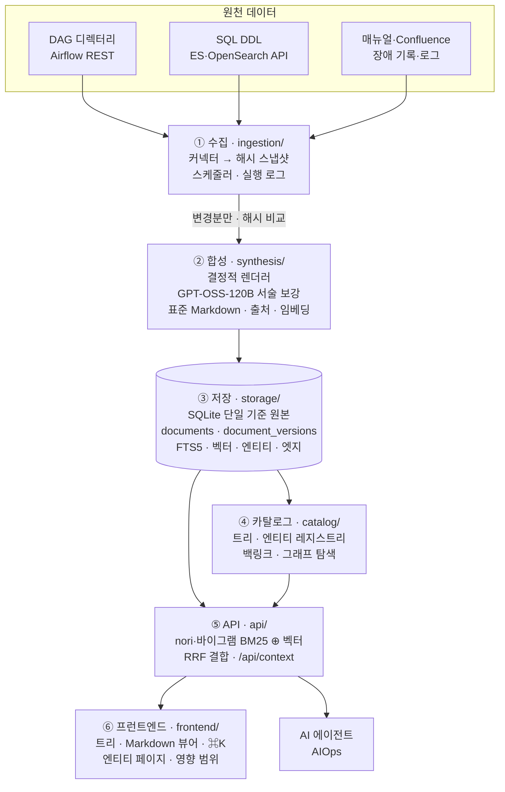

# ai-opspedia — 개요와 전체 계획

> 상태: **plan v1 — 리뷰 ×3 완료** ([review-log.md](review-log.md)) · 담당: huklee · 최종 수정: 2026-09-28 (ADR-018·019 반영)

## 1. 한눈에 보기

- **무엇**
  - 운영 백과사전 대상
    - **추천 배치 시스템**: Airflow DAG, feature / candidate / ranking / training 배치와 그 테이블
    - 이 시스템이 데이터를 넣는 **검색 인덱스**: Elasticsearch/OpenSearch 인덱스, alias, 리인덱스/롤오버 작업
  - DAG 코드, SQL DDL, 인덱스 메타데이터, 매뉴얼, 장애 포스트모템·티켓 같은 원자료를 AI가 위키 하나로 조립
  - 탐색·검색 가능하고 페이지끼리 링크된 위키
    - 조회 주체: **사람**(운영자·엔지니어 20–50명)과 **AI 에이전트**(AIOps 어시스턴트)
- **왜**
  - 운영 지식이 DAG 저장소, Confluence, 티켓, Slack, 사람 머릿속에 분산
  - 장애 때 묻는 질문은 늘 동일
    - *이 DAG는 뭘 하나, 이 테이블은 누가 읽나, 어느 인덱스로 가나, 지난번엔 뭐가 깨졌고 어떻게 고쳤나*
  - 지금은 답 하나에 도구 다섯 개를 열어야 함
- **어떻게**
  - Python 배치 파이프라인
    - 정형 소스는 **결정적(deterministic)으로** 파싱
    - LLM(사내 GPT-OSS-120B)은 규칙·템플릿이 못 하는 **서술만 작성**
  - 한국어 검색: nori 형태소 분석(ES/OpenSearch `_analyze`) + 바이그램 안전망
  - 저장: SQLite 파일 하나(문서 + BM25 + 벡터 + 그래프 엣지)
  - Python 웹 서버 하나가 제공하는 것
    - 트리 탐색 위키, `⌘K` 검색, 에이전트용 JSON API

### 목표와 비목표

| 목표 (v1) | 비목표 (v1) |
|---|---|
| DAG, 테이블, **인덱스 패밀리**(롤오버 후에도 유지), alias, 템플릿, 수명 주기 정책, 장애, 런북, 서비스, 시스템, 팀별 페이지 자동 생성·최신 유지 | Airflow/ES 콘솔·실시간 모니터링 대체 (스냅샷만, 운영 안 함) |
| **검색 인덱스 감독:** 상태, alias/빌드 최신성, 문서 수 변동, 매핑 변경, 롤오버/리인덱스/alias 전환 런북 | 인덱스 작업(리인덱스, alias 전환) 실행 · v1은 설계상 읽기 전용 ([ADR-016](decisions.md#adr-016)) |
| 모든 사실의 출처(파일 + 라인, API + 타임스탬프, 티켓 id) 추적 | 수평 확장, 멀티 테넌트, HA |
| **한국어 검색 품질 최우선**: nori 형태소 분석 + 바이그램 안전망 + 식별자 · 하이브리드 검색(키워드 + 시맨틱) | WYSIWYG 편집 (사람은 Markdown 수정·상태 관리만) |
| "영향 범위" 응답: DAG ↔ 테이블 ↔ 인덱스 ↔ 장애 링크 | 자체 그래프 DB, 워크플로 엔진, 검색 클러스터 |
| 에이전트용 API (검색, 페이지, 트리 컨텍스트, 엔티티 조회) | 공개/인터넷 노출 (tailnet 전용) |

### 선택한 방식: Option A "SQLite 기반 경량 Python 모놀리스"

- 세 가지 방식 검토(전체 비교는 [options.md](options.md))

| 방식 | 스택 | 판단 |
|---|---|---|
| **A. 경량 모놀리스** | Python 프로세스 1개(FastAPI) · **SQLite 파일 1개**(문서, FTS5 BM25, 벡터 BLOB + numpy, 엣지 테이블) · Markdown 전문·버전도 같은 SQLite에(`documents`, `document_versions`) | ✅ **선택** · 구현 속도 최고 · 인프라 불필요 · 전부 직접 다루고 교체 용이 |
| B. Postgres 중심 | FastAPI + PostgreSQL (tsvector, pgvector, ltree) | 업그레이드 경로로 적합 · DB 서버 필요 · 한국어 FTS는 여전히 손봐야 함 |
| C. PRD 그대로의 폴리글랏 | Postgres + OpenSearch + Qdrant + Neo4j (+ 자체 작업용 Airflow) | 기능은 최다 · 운영할 서비스 ~4개 증가 · "직접 다루고, 빠르고, 작게"와 불일치 |

- 근거 수치(대상 호스트 측정, [research.md](research.md) §2)
  - **50 000 × 1024-d** 벡터 전수 코사인 = **5.3 ms / 205 MB**
  - SQLite FTS5 + 자체 한국어 바이그램·식별자 분석기
    - `장애`, `파이프라인`, `feature store → feature_store_daily` 모두 검색
    - 기본 `trigram`은 2음절 한국어 단어 누락
  - 바이그램 분석기의 역할
    - 재현율 안전망으로 유지
    - 1순위는 nori 토큰 컬럼(`_analyze`, 사용자 사전 포함)
    - 쿼리 분석 목표 p95 +20 ms 이내
  - 임베딩 기본값은 로컬 KURE-v1(bge-m3 한국어 파인튜닝, MTEB-ko-retrieval 0.762)
  - 저장소 접근은 작은 인터페이스 하나로 통일
    - A가 한계에 오면 모듈 하나만 바꿔 Option B로 전환([ADR-020](decisions.md#adr-020))
- 주요 결정 (전체는 [decisions.md](decisions.md))
  - LLM 상한은 **GPT-OSS-120B**([ADR-018](decisions.md#adr-018))
    - 사내 서빙, OpenAI 호환 API, `LLMClient` 뒤라 설정으로 교체
    - 요약·추출·분류·표준화는 규칙·템플릿 우선, LLM은 잔여분만
    - 토큰 과금 없음, 제약은 GPU 처리량
  - 한국어 검색([ADR-019](decisions.md#adr-019), [ADR-005](decisions.md#adr-005))
    - nori `_analyze` + 사용자 사전(엔티티 레지스트리 식별자) + 바이그램 안전망
    - RRF 결합, LLM 리랭크 없음
    - 목표 미달 시 키워드 검색만 전용 ES/OpenSearch 인덱스로 이전
  - git 사용 안 함([ADR-020](decisions.md#adr-020))
    - SQLite가 유일한 기준 원본, Markdown 전문 + 전체 버전 저장
    - 백업은 매일 `Connection.backup()`
    - DAG 코드는 디렉터리 스캔 또는 Airflow REST `dagSources`
  - 임베더 교체 가능: 로컬 KURE-v1 ▸ bge-m3 ▸ (외부 API 승인 시) Voyage ▸ 끔([ADR-006](decisions.md#adr-006))

### 아키텍처 한눈에 보기

### 컴포넌트와 문서

| # | 컴포넌트 (코드 디렉터리) | 한 줄 역할 | 문서 |
|---|---|---|---|
| 1 | Ingestion Engine & Connectors (`ingestion/`) | DAG 저장소, Airflow, DB 스키마, ES, 매뉴얼, 장애에서 원자료 수집 · 스냅샷 + 해시 · 스케줄링 | [components/01-ingestion.md](components/01-ingestion.md) |
| 2 | Knowledge Synthesis Engine (`synthesis/`) | 원자료 → 표준 Markdown(frontmatter, 엔티티, 트리 경로, 요약, 청크, 임베딩) | [components/02-synthesis.md](components/02-synthesis.md) |
| 3 | Multi-Layer Storage (`storage/`) | SQLite 하나(유일한 기준 원본) · 문서 Markdown 전문/버전, FTS5, 벡터, 엔티티/엣지, 작업 | [components/03-storage.md](components/03-storage.md) |
| 4 | Tree & Catalog Manager (`catalog/`) | 트리, 엔티티 레지스트리, 백링크, 상호 참조, 의존성 그래프 쿼리 | [components/04-catalog.md](components/04-catalog.md) |
| 5 | Search & Retrieval API (`api/`) | 하이브리드 검색(nori + 바이그램 + 벡터, RRF), 페이지/트리 컨텍스트/엔티티/그래프 엔드포인트, 에이전트 도구, 인증 | [components/05-search-api.md](components/05-search-api.md) |
| 6 | Wiki Frontend Viewer (`frontend/`) | 트리 탐색, Markdown 리더, ⌘K 검색, 엔티티·백링크 패널 | [components/06-frontend.md](components/06-frontend.md) |
| — | 지식 모델 (공통) | 문서 타입, frontmatter 스키마, 엔티티·엣지 타입, ID, 출처 | [knowledge-model.md](knowledge-model.md) |
| — | 플랫폼 (공통) | 런타임, 설정, 인증, 보안, 배포, 백업, 처리량, 관측성 | [platform.md](platform.md) |
| — | 결정 기록 | ADR 로그 (선택별 이유) | [decisions.md](decisions.md) |
| — | 조사 | 조사 노트, 선행 사례, 측정값, 참고 자료 | [research.md](research.md) |
| — | 방식 비교 | 3가지 방식, 점수, 선택 | [options.md](options.md) |
| — | 로드맵 | 마일스톤, 우선순위별 작업, 완료 기준 | [roadmap.md](roadmap.md) |
| — | MVP / PoC | 오픈소스 기반 PoC 범위, 컴포넌트별 커버리지, 교체 원칙 | [mvp-poc.md](mvp-poc.md) |
| — | 리뷰 로그 | 리뷰 3회와 회차별 변경 | [review-log.md](review-log.md) |

### 설계 원칙 (모든 컴포넌트 공통)

1. **사실은 파서가, 서술은 LLM이**
   - DAG 스케줄, 태스크 그래프, 컬럼, 매핑, alias는 코드·API에서 결정적으로 렌더링
   - LLM 담당은 규칙으로 못 채운 요약·설명·분류 서술뿐
   - LLM이 지어낸 사실 없음
2. **모든 것에 출처**
   - 문서·청크마다 출처(path@content_hash:line, API@time, 티켓 id), 생성기 버전, 입력 해시 기록
   - UI에 "generated from …" 표시
3. **증분 처리와 멱등성**
   - 모든 단계를 콘텐츠 해시로 필터링
   - 입력이 같으면 재실행해도 변화 없음(불필요한 diff도, 불필요한 LLM 호출도 없음)
4. **기준 원본(source of truth)은 SQLite 하나, git 없음**([ADR-020](decisions.md#adr-020))
   - 저장 구조
     - `documents`에 현재 Markdown 전문
     - `document_versions`에 전체 버전(append-only)
     - 이력·diff는 자체 화면
   - 파생 데이터
     - FTS, 청크, 벡터, 엔티티, 엣지
     - `opspedia rebuild`로 `documents`에서 재생성
5. **직접 다루고 교체할 수 있는 부품**([ADR-001](decisions.md#adr-001))
   - 작은 건 직접 구현
   - 라이브러리(플랫폼 말고)는 며칠을 아낄 때만, 인터페이스 뒤에 배치
6. **결정은 사람이**
   - 페이지별 리뷰 상태(`generated → reviewed → verified`, 또는 `stale`)
   - 어느 섹션이든 클릭 한 번으로 정정
     - `human:` 블록이 생성 텍스트를 대체
     - 이후 생성에도 반영됨
   - 사람이 쓴 페이지는 생성기가 절대 덮어쓰지 않음
7. **새벽 3시 우선**
   - 엔티티 페이지마다 온콜, 링크, *갱신 시각이 붙은* 실시간 상태, 다운스트림 표시
   - 알림 핸들러도 같은 정보를 호출 한 번으로 수신(`/api/context`, `/e/<entity>` 고정 URL)
8. **LLM 없는 자동화 우선**([ADR-018](decisions.md#adr-018))
   - 규칙 기반 처리
     - 요약: frontmatter 사실 정보 + 템플릿 문장
     - 엔티티 추출: 레지스트리 + Aho–Corasick + 정규식
     - 분류: 타입 + 시스템 규칙
     - 장애·매뉴얼 표준화: 필드·구조 매핑
   - LLM(GPT-OSS-120B)은 규칙 실패분과 서술 보강만
   - `llm=off`여도 R1·M1b 전체와 M2의 결정적 부분 동작
9. **한국어 검색 품질 최우선**([ADR-019](decisions.md#adr-019))
   - nori 형태소 분석 + 사용자 사전 + 바이그램 안전망
   - 동의어는 쿼리 확장
   - 한국어 평가 세트 기준치(recall@5 ≥ 0.85, MRR@10 ≥ 0.7, 무결과율 < 5 %)로 품질 판단

### 배포 계획 (요약, 자세한 내용은 [roadmap.md](roadmap.md))

| 릴리스 / 마일스톤 | 결과 | 규모 |
|---|---|---|
| **R1 온콜 카탈로그** (M0 + M1a, LLM 없음) | 코드 + API로 만든 DAG / 테이블 / 인덱스 패밀리 / alias 페이지 · **nori 기반 한국어 키워드 검색** · 세부는 표 아래 보충 | **9–11 d** |
| M1b 카탈로그 심화 | 파이프라인 + 리니지, 컬럼 단위 영향 분석, 에이전트용 `/api/context`, 템플릿과 정책 | 3–5 d |
| M2 LLM 합성과 하이브리드 검색 | 매뉴얼·장애 → 표준 Markdown(규칙·템플릿 우선) · GPT-OSS-120B 인용 달린 서술(한국어 서술 품질 평가 후 활성화) · 한국어 평가 세트 기반 하이브리드 검색 | 7–10 d |
| M3 상호 링크와 그래프 | 백링크, 자동 링크, 다단계 영향 범위, 알려진 장애, lint | 3–4 d |
| M4 에이전트와 큐레이션 | 검색·트리 컨텍스트 API, 리뷰 워크플로와 큐, 백업, 지표 | 3–5 d |
| | **합계 ≈ 25–35 영업일 · 첫 실용 릴리스는 ~11일 차** | |

- **보충:** 온콜 카탈로그 결과 세부
  - 갱신 시각 붙은 실시간 상태, 다운스트림 목록, 인덱스 상태 점검
  - 온콜 + 링크, 트리, ⌘K
  - nori 기반 한국어 키워드 검색 목표: 한국어 recall@5 ≥ 0.85, MRR@10 ≥ 0.7, 무결과율 < 5 %
  - 섹션 정정 + 피드백

### 확인이 필요한 질문

- 질문마다 **기본값** 있음
  - 답이 없으면 그 값으로 진행
  - 답하는 데 몇 분이면 충분
- ★ = R1을 막는 질문

| # | 질문 | 답이 없을 때 기본값 |
|---|---|---|
| Q1 ★ | Airflow **버전·접근 방법**: REST URL, 읽기 전용 계정, DAG 폴더 경로 | Airflow 2.x `/api/v1` + basic auth · DAG 코드는 DAG 폴더 디렉터리 스캔(없으면 REST `dagSources`) |
| Q2 ★ | 검색 엔진 **종류/버전**, 클러스터, 읽기 전용 자격 증명 | Elasticsearch 8, 운영 클러스터 1개 · OpenSearch 분기는 요청 시에만 |
| Q3 ★ | **스키마** 위치(DDL 파일 디렉터리? 웨어하우스 `information_schema`?)와 SQL 방언 | DDL 파일 디렉터리 스캔, 방언은 설정에서 지정 |
| Q4 | **매뉴얼**·**장애** 기록 위치(Confluence 스페이스? Jira 프로젝트? 포스트모템 폴더?), DC/Cloud 여부 | Confluence DC + Jira DC, 포스트모템 폴더 |
| Q5 | **GPT-OSS-120B 사내 엔드포인트** URL·인증·처리량(동시성)? · 별도로, 마스킹한 텍스트를 **외부 임베딩 API**(Voyage)로 보내도 되나? | 엔드포인트 확인 전까지 `llm=off` → R1/M1b는 LLM 없이 진행 · 임베딩은 로컬 KURE-v1 · 외부 API는 승인 전까지 **불가** |
| Q6 | 호스트 | tailnet의 이 Mac mini (ai-research-note와 동일) |
| Q7 | 알림 이력용 모니터링 스택 (Alertmanager, Grafana, Datadog…) | Airflow 태스크 실패만 |
| Q8 | 추천 시스템 테이블/인덱스를 소비하는 **서비스** 목록 (영향 범위 계산용) | 설정에 넣는 목록 · 그 전까지는 비어 있음 |
| Q9 | 작은 **라이브러리**(FastAPI, sqlglot, markdown-it, numpy, httpx) 사용 가능? · 표준 라이브러리만? | 라이브러리 사용([ADR-001](decisions.md#adr-001)) · 표준 라이브러리만 쓰면 ≈ 3–4 d 추가 |
| Q10 ★ | 범위 안 DAG, 테이블, 인덱스/패밀리의 대략적 **개수** | DAG ~200개, 테이블 ~500개, 패밀리 ~30개 (처리량·견적 기준) |
| Q11 | **시스템별 리뷰어/챔피언** | 설정의 담당 팀 리드 |
| Q12 ★ | 모든 사용자가 **개인 신원으로 tailnet에** 접속? | 예 → Tailscale 신원 사용 · 아니면 로컬 계정 (+1 d) |
| Q13 | `/api/context`를 호출할 **AIOps 에이전트 / 알림 핸들러**와 알림 페이로드 형태 | Airflow `on_failure_callback` + 범용 JSON 알림 |
| Q14 | 기존 **런북** 위치 | 설정 `runbooks:`로 연결한 Confluence 페이지 |
| Q15 ★ | nori 플러그인(`analysis-nori`)이 설치된 **클러스터**와 `_analyze` 호출 **권한**(읽기 전용 역할)? | 대상 prod 클러스터에 설치 · `monitor` + `view_index_metadata`로 `_analyze` 호출 가능하다고 가정 · 불가 시 python-mecab-ko 로컬 폴백 |

- **보충:** nori 권한 기본값의 확인 사항
  - 인덱스 없는 `_analyze`에 클러스터 권한이 필요한지 확인 필요
