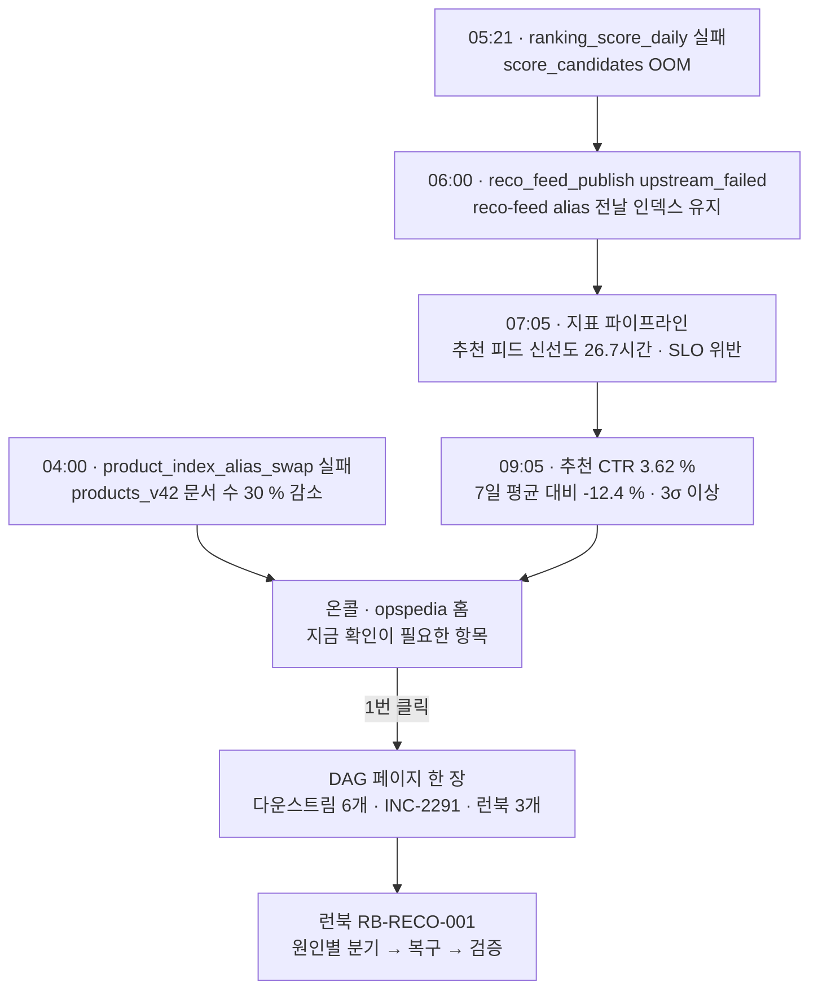

# ai-opspedia PoC — 새벽 5시 21분, 랭킹 배치가 멈춘 날

> 상태: **PoC 결과 보고** · 2026-09-29 · 상세 수치는 [mvp-poc.md](mvp-poc.md) §9 · 결정 [ADR-021](decisions.md#adr-021)

## 결론 먼저

> **LLM 없이, 코드와 API만으로 "새벽 3시 질문"의 답을 한 화면에 모으는 것은 가능.**
> **남은 불확실성은 단 두 가지 — 실데이터에서의 한국어 검색 품질, 그리고 실제 GPT-OSS-120B 의 서술 품질.**
> **권장: R1 착수. 키워드 검색은 SQLite FTS5 + nori 로 시작, OpenSearch 전용 인덱스는 실데이터 재평가 후 결정.**

| 숫자 | 의미 |
|---|---|
| **65** | 파서 · API 만으로 자동 생성된 페이지 (DAG 12 · 테이블 15 · 인덱스 3 · alias 3 · 장애 5 · 런북 7 · 지표 12 · 카테고리 4 · 시스템 · 팀) |
| **1번 클릭** | 홈 → 실패한 DAG 페이지 → 다운스트림 · 알려진 장애 · 런북 · 온콜 |
| **1번 호출** | 에이전트용 `/api/context` · MCP `context` 로 같은 답 |
| **24회** | 지난 1주 실행 이력 재현 — 버전 · diff · 합성 내역 전부 실제 파이프라인 결과 |
| **1 / 3** | 풍부해진 코퍼스에서 한국어 검색 기준을 넘은 비교군 수 → **실데이터 재측정 필요** |
| **34** | 자동 테스트 통과 |

---

## 1. 그날 아침에 벌어진 일 (dummy 시나리오)

- **지금까지의 대응**
  - Airflow 알림 → Airflow UI → DAG 코드 저장소 → Confluence 런북 검색 → Jira 과거 장애 검색 → Grafana 지표
  - 도구 5개, 검색어를 바꿔가며 찾기
- **PoC 에서의 대응**
  - 홈의 "지금 확인이 필요한 항목" 최상단에 🔴 `reco-feed` · ❌ `ranking_score_daily`
  - DAG 페이지 한 장에 필요한 것 전부
    - 최근 실행(❌ failed 05:00 → 05:21), 담당 · 온콜 · 채널
    - 다운스트림 3홉: `reco_feed_publish` ⛔ → `reco-feed` 🔴 → `reco-feed alias` 🔴 · `ctr_report_daily`
    - 알려진 장애: **INC-2291** "ranking_score_daily 실패로 추천 피드 미갱신" (같은 증상, 원인 · 조치 기록)
    - 런북: 추천 피드 미갱신 대응 · 랭킹 배치 OOM 대응 · 피처스토어 백필
  - 지표 페이지: 사용자 영향이 숫자로 — 피드 신선도 26.7시간, CTR -12.4 %
  - 같은 아침의 두 번째 사건: products alias 전환 차단 → 인덱스 패밀리 페이지 한 장에 "문서 수 30 % 감소 · 전환 DAG 실패 · 레플리카 yellow" 와 전환 · 롤백 런북

## 2. 어떻게 만들어졌나 — 사실은 파서가, 서술은 LLM 이

- **원천 6종을 읽기 전용으로**
  - DAG 코드(`ast` + `sqlglot` 리니지), Airflow REST, DDL, 검색 엔진 `_cat` · `_alias`, Jira, 매뉴얼(Markdown · Confluence HTML → `markitdown`), 지표(Prometheus 형태)
- **엔티티 · 엣지를 먼저, 문장은 나중에**
  - SQL 에서 읽기/쓰기 테이블, 센서에서 DAG 간 의존, 빌드 오퍼레이터에서 인덱스 패밀리
  - 장애 · 런북 본문은 레지스트리 이름 매칭(Aho–Corasick)으로 엔티티에 연결
- **결정적 템플릿이 페이지를 쓰고, LLM 은 장애 요약만 보조**
  - 모든 문장에 `[S#]` 인용 필수 → 인용 없는 문장이 하나라도 있으면 **거절**, 템플릿 요약 유지
  - 시연(mock LLM): 5건 중 4건 통과, INC-2330 은 "재발 방지 모니터링 강화 필요"라는 근거 없는 문장 때문에 거절 → 설계대로 동작
- **SQLite 한 파일이 기준 원본, 변경은 버전으로**
  - 1주 동안 24회 실행 · 누적 버전 약 380개
  - 상태만 새로 읽은 실행은 0–2개 페이지만 갱신 (조회 시각은 본문이 아닌 스냅샷 속성으로 분리)
  - 관리자 화면에서 실행마다 단계 폭포수 · 바뀐 섹션 · diff 확인
- **실제로 남은 흔적 (재현된 1주)**

| 시각 | 무슨 일 | 페이지에 남은 변화 |
|---|---|---|
| 09-22 06:00 | 초기 적재 | 63개 신규 생성 |
| 09-23 06:00 | 신규 DAG `ctr_report_daily` | DAG · 테이블 생성, `reco.ranked_items` 의 "사용" 갱신 |
| 09-24 06:00 | DDL 에 `reco.users.segment` 추가 | 테이블 컬럼 섹션 갱신 |
| 09-24 11:20 | Confluence 커넥터 타임아웃 | 실행 `partial` · 마지막 정상 스냅샷 재사용 · 런북 유지 |
| 09-25 06:00 | 랭킹 SQL 에 모델 레지스트리 조인 | 태스크 · 리니지 · SQL 섹션 갱신, 새 엣지 |
| 09-26 14:10 | 런북 개정 (수동 실행) | 롤백 · 공지 템플릿 섹션 추가 |
| 09-27 10:05 | Jira 웹훅 INC-2330 | 장애 페이지 생성 · LLM 서술 거절 |
| 09-29 06:00 | 랭킹 실패 · alias 전환 실패 | 상태 · 다운스트림 · 점검 섹션 갱신 |

## 3. 증명한 것과 아직 모르는 것

| 가설 | 판정 | 한 줄 |
|---|---|---|
| H1 코드 · API 만으로 페이지 생성 | ✅ | 65개 전부 · 재실행 멱등 |
| H3 드릴 시나리오 1–2 | ✅ | 클릭 1번 · 한 화면 |
| H5 에이전트 한 번 호출 | ✅ | `/api/context` · MCP |
| H4 LLM 서술 품질 | ◐ | 인용 검사 · 거절 흐름만 검증, 실제 모델 미연결 |
| H2 한국어 검색 품질 | ⚠️ | **코퍼스가 풍부해지자 기준 이탈 → 실데이터 필요** |

- **H2 가 흔들린 과정 — 이 PoC 의 가장 중요한 교훈**

| 비교군 | 1차 · 문서 47개 | 2차 · 문서 65개 | 2차 · 섹션 청크 |
|---|---|---|---|
| OpenSearch nori | ✅ 0.88 / 0.77 | ❌ 0.79 / 0.69 | ❌ 0.78 / 0.70 |
| FTS5 + nori `_analyze` + 바이그램 | ✅ 0.87 / 0.75 | ❌ 0.84 / 0.73 | **✅ 0.86 / 0.72** |
| 바이그램 단독 | ✅ 0.87 / 0.75 | ❌ 0.83 / 0.72 | ❌ 0.81 / 0.68 |

- 값: recall@5 / MRR@10 · 기준 0.85 / 0.70
- 긴 런북 · 지표 페이지가 들어오자 "장애", "대응" 같은 일반어가 긴 문서로 쏠림
- 설계에 있던 **섹션 청크 색인 → 문서 묶기**를 적용하자 FTS5 + nori 만 회복
- 실패 질의 다수는 정답 자체가 모호 ("장애 대응 가이드" ↔ 런북 7개 모두 해당)
- 결론: dummy 세트로는 우열 판단 불가 · **운영자 실제 질의로만 판정 가능**

## 4. 결정 요청

| # | 요청 | 권장 | 필요한 것 |
|---|---|---|---|
| 1 | **R1 착수** | ✅ 승인 권장 — H1 · H3 · H5 통과, 남은 위험은 R1 안에서 측정 가능 | — |
| 2 | 키워드 검색 기본값 | **FTS5 + nori `_analyze`** (운영 서비스 +0), OpenSearch 전용 인덱스는 실데이터 재평가 후 | Q15: `_analyze` 권한 |
| 3 | 실데이터 읽기 전용 연결 | Airflow · ES · DDL 먼저 (R1 차단 요소) | Q1 · Q2 · Q3 자격 증명 |
| 4 | 운영자 질의 수집 | 2명 × 1시간, 질의 80–100개 | 운영자 시간 |
| 5 | GPT-OSS-120B 엔드포인트 | 확보 전까지 `llm=off` 로 R1 진행 | Q5 |

## 5. 오픈소스는 교체 가능한 부품으로

- PoC 는 오픈소스 최대 활용 (OpenSearch · sqlglot · markitdown · pyahocorasick · networkx · FastAPI · markdown-it-py · MCP SDK · Mermaid · Chart.js)
- 모든 부품은 설계 인터페이스 뒤 `adapters/` 에만 위치 → 본 구현에서 모듈 단위 교체
- 데이터는 SQLite 에만 → 어떤 부품을 바꿔도 `rebuild` 한 번으로 재색인
- 이미 한 번 교체해 봄: 위키 뷰어 MkDocs → 자체 뷰어 (동적 화면 필요), 다른 모듈 변경 없음

## 부록 — 직접 보기

- 서버: `poc/` 에서 `uv run opspedia-poc serve` (tailnet 또는 로컬 `--http`)
  - 홈 `/` · 검색 `/search?q=추천 피드 미갱신` · DAG `/e/dag:ranking_score_daily`
  - 지표 `/metrics` · 관리자 `/admin` · 실행 상세 `/admin/runs/run-20260927-100500-full`
- 코드 · 실행 방법: [`poc/README.md`](../poc/README.md)
