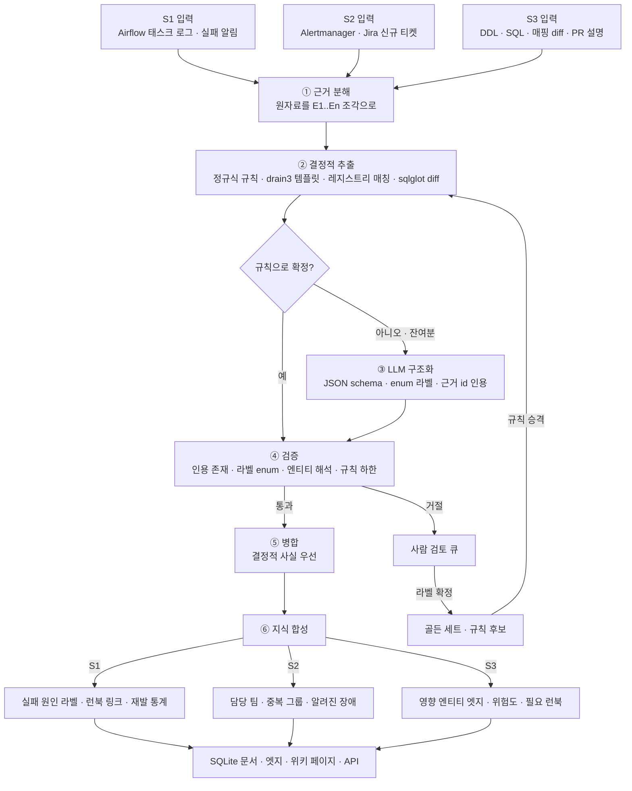

# 지식 합성 파이프라인 재사용 시나리오 — 파서 · 분류기

> 상태: **제안 v0 (리뷰 전)** · 담당: huklee · 작성: 2026-09-29 · 기반: [`incident_parse.py`](../poc/opspedia_poc/synthesis/incident_parse.py) 6단계 파이프라인

## 1. 한눈에 보기

- **전제**
  - 장애 요약용으로 만든 6단계(근거 분해 → 결정적 추출 → LLM 구조화 → 검증 → 병합 → 지식 합성)는 사실 "근거를 인용하는 파서 / 분류기"의 일반형
  - 입력 원자료와 JSON schema, 규칙 표만 바꾸면 다른 문제에 그대로 재사용 가능
  - 제약 동일: LLM 상한 GPT-OSS-120B · 규칙 우선, LLM은 잔여분 · SQLite 기준 원본 · v1 읽기 전용([ADR-016](decisions.md#adr-016))
- **선택한 시나리오 3개**
  - **S1. Airflow 실패 로그 원인 분류기** — 태스크 로그 → 실패 원인 라벨 + 런북 연결
  - **S2. 알림 · 티켓 트리아지 분류기** — 알림 / Jira 신규 티켓 → 담당 팀 · 심각도 · 중복 묶음 · 알려진 장애 매칭
  - **S3. 변경 영향 분류기** — DDL · DAG SQL · ES 매핑 · PR 설명 diff → 영향 엔티티 · 위험도 · 필요한 런북
- **추천: S1 먼저**
  - 규칙만으로 대부분 분류 가능(OOM, 토큰 만료, 타임아웃은 로그 문구가 거의 고정) → "비LLM 우선" 원칙에 가장 잘 맞음
  - 정답 라벨을 이미 보유: Jira `customfield_root_cause`(dummy 6건 중 5건이 OOM · 상류 지연 · 토큰 만료 · 운영 누락으로 바로 매핑)
  - 결과물이 S2 · S3의 입력 신호가 됨 (원인 라벨 = 라우팅 · 유사 장애 매칭의 핵심 피처)
  - PoC 코드 재사용률 최고: 근거 조각 · 레지스트리 매칭 · 인용 검증 그대로, 새로 필요한 건 규칙 표와 drain3 정도
- **제외한 후보와 이유**
  - (d) 대화 → 런북 개정 제안: 가치 높지만 S1 라벨과 런북 목차가 먼저 있어야 "공백" 판정 가능 → S1 이후 2단계
  - (e) 포스트모템 조치 항목 추출: `IncidentExtract.follow_ups`로 이미 절반 구현 → 별도 시나리오보다 기존 합성의 확장으로 처리
    - 확장 시 기준: 조치 항목마다 담당자 1명 · 추적 가능한 티켓 ([Google SRE Postmortem Culture](https://sre.google/sre-book/postmortem-culture/), [Postmortem Action Items](https://research.google/pubs/postmortem-action-items-plan-the-work-and-work-the-plan/)), incident.io식 "채널 대화에서 빠진 후속 조치 제안" ([Suggested follow-ups](https://docs.incident.io/en/articles/8795211-ai-feature-suggested-follow-ups))

### 비교표

| 항목 | S1. 실패 로그 원인 분류 | S2. 알림 · 티켓 트리아지 | S3. 변경 영향 분류 |
|---|---|---|---|
| 입력 | Airflow 태스크 로그, `on_failure_callback` 알림, DAG run 이력 | Alertmanager webhook, Airflow 실패 알림, Jira 신규 티켓 | DDL 스냅샷 diff, DAG SQL diff, ES 매핑 · alias diff, PR / 커밋 설명 |
| 출력 | 증상 라벨 · 원인 가설 · 근거 로그 라인 · 런북 id | 담당 팀 · 심각도 · 중복 그룹 키 · 알려진 장애 top-3 | 변경 유형 · 영향 엔티티 목록 · 위험도 · 필요한 런북 · 알릴 팀 |
| 파서 vs 분류기 | 파서(템플릿 추출) + 분류기(원인) | 분류기(다중 라벨) + 매처(중복 · 유사) | 파서(AST · JSON diff) + 분류기(위험도) |
| 비LLM으로 되는 부분 | 정규식 규칙, drain3 템플릿, 종료 코드, 재시도 횟수, 상류 run 시각 비교 | 엔티티 → 소유 팀(카탈로그), 핑거프린트 중복, 그래프 상류 관계, 라벨 심각도 | sqlglot diff, 매핑 규칙 표(타입 변경 = 리인덱스), 그래프 다운스트림 순회 |
| LLM이 필요한 부분 | 규칙 미스 로그의 원인 추정, 원인 한 줄 설명 | 자유 서술 티켓의 엔티티 · 증상 추정, 판단 근거 문장 | PR 설명의 의도 · "의미상 변경"(필터 조건 등) 판단, 위험 사유 서술 |
| 검증 방법 | 인용 로그 라인 존재, 라벨 enum, 규칙 결과와 충돌 시 규칙 우선 | 팀은 카탈로그 소유 팀 집합 안에서만, 엔티티 레지스트리 해석 | 영향 엔티티는 그래프 도달 집합 안에서만, 위험도 ≥ 규칙 하한 |
| 기대 효과 | 첫 5분 진단 단축, 재발 원인 통계 | 오배정 · 중복 호출 감소, 알려진 장애 즉시 연결 | 배포 전 영향 파악, 리인덱스 · alias 전환 누락 방지 |
| 난이도 | 하 | 중 | 중상 |
| 우선순위 | **1** | 2 | 3 |

## 2. 공유 파이프라인과 연결 지점



- 핵심 루프: **LLM이 푼 것 → 사람 확정 → 규칙으로 승격** → 시간이 갈수록 LLM 호출 비율 감소
  - LILAC · LogParser-LLM의 "템플릿 캐시가 LLM 호출을 흡수" 구조와 같은 발상 ([LILAC](https://arxiv.org/abs/2310.01796), [LogParser-LLM](https://arxiv.org/abs/2408.13727))

## 3. S1. Airflow 실패 로그 원인 분류기 (추천 1순위)

### 문제

- 실패 알림은 "failed"만 알려줌 → 원인 파악은 로그를 열어 사람이 읽음
- 예 (dummy INC-2291 · INC-2341)
  - 알림: `score_candidates failed after 3 tries: Container killed by YARN for exceeding memory limits (14.2 GB of 12 GB)`
  - 증상은 OOM이지만 **진짜 원인은 상류**: `candidate_gen_hourly` 04시 중복 실행 → `reco.candidates` 파티션 3배
  - 증상만 보고 메모리 증설하면 오답 → **증상(symptom)과 원인(cause)을 분리**해 분류해야 함
- 그 외 dummy 사례: INC-2198 서비스 계정 토큰 만료 · INC-2254 원천 파티션 도착 지연 · INC-2330 DAG 일시정지 해제 누락

### 업계 사례

- **Astronomer (Airflow Summit 2024)**: 대량 Airflow 실패 로그를 NLP · 군집화로 분석, 주 원인으로 메모리 부족 · 인증 만료 · 불안정한 상류 데이터 소스 제시 ([세션](https://airflowsummit.org/sessions/2024/why-do-airflow-tasks-fail-an-analysis-through-machine-learning-techniques/))
  - 본 문서의 라벨 체계와 거의 일치 → 라벨 설계의 출발점으로 적합
- **Drain / drain3**: 고정 깊이 파스 트리로 로그를 템플릿(군집)으로 묶는 스트리밍 템플릿 마이너 ([logpai/Drain3](https://github.com/logpai/Drain3), MIT)
  - 마스킹 규칙(IP · 숫자), 파일 · Redis 영속화, 학습 없이 기존 템플릿에만 맞추는 `match()` 추론 모드 지원
- **Datadog Log Patterns · Watchdog**: 메시지가 비슷한 로그를 패턴으로 묶고, 새 패턴 · 패턴 급증을 이상으로 표시 ([Patterns](https://docs.datadoghq.com/logs/explorer/analytics/patterns/), [Watchdog Insights](https://docs.datadoghq.com/logs/explorer/watchdog_insights/))
  - 시사점: "처음 보는 템플릿" 자체가 강한 신호 → 미분류 큐 우선순위로 사용
- **LLM 로그 파싱 연구** (짧게): DivLog · LILAC · LogParser-LLM 모두 "소수 예시 + 템플릿 캐시"로 LLM 호출을 크게 줄임 ([DivLog](https://arxiv.org/abs/2307.09950), [LILAC](https://arxiv.org/abs/2310.01796), [LogParser-LLM](https://arxiv.org/abs/2408.13727))
  - 실무 결론: LLM은 **새 템플릿에만** 호출, 결과는 캐시 · 규칙으로 고정

### 설계

- **① 근거 분해**
  - 태스크 로그를 라인 단위 조각으로, 단 스택트레이스는 한 조각으로 묶음
  - 로그 전체가 아니라 **마지막 N줄 + ERROR/Exception 주변 ±5줄**만 사용 (GPU 처리량 절약)
  - 추가 근거: 알림 라벨(`try_number`, `task_id`), 같은 날 상류 DAG run 이력(`airflow.json`의 `dag_runs`)
- **② 결정적 추출**
  - 규칙 표 `failure_rules.yaml`: 정규식 → 증상 라벨 → 런북 id

| 증상 라벨 | 규칙 예 | 런북 |
|---|---|---|
| `oom` | `exceeding memory limits`, `OutOfMemoryError`, 종료 코드 137 / SIGKILL | RB-RECO-002 (ranking-oom) |
| `auth_expired` | `401`, `token expired`, `PERMISSION_DENIED` | — (공백 후보) |
| `upstream_delay` | `ExternalTaskSensor` 타임아웃, 원천 파티션 없음 | SOP-DP-001 (backfill) |
| `guard_blocked` | `doc count drop .* > max_doc_drop` | RB-SRCH-001 (alias-swap) |
| `schema_mismatch` | `AnalysisException: cannot resolve`, `column .* not found` | — |
| `timeout` | SIGTERM, `execution_timeout` | SOP-RECO-003 (dag-rerun) |

  - drain3로 템플릿 id 부여 → 같은 템플릿은 이전 판정 재사용(캐시)
  - **원인 후보 생성은 그래프로**: 증상 엔티티의 상류 DAG · 테이블 중 같은 날 이상 run(중복 실행, 지연, 실패)을 결정적으로 나열
    - INC-2291: `ranking_score_daily` ← `reco.candidates` ← `candidate_gen_hourly` 04시 2회 실행 → 원인 후보 `duplicate_run`
- **③ LLM 구조화** (규칙 미스 또는 원인 후보가 2개 이상일 때만)

```python
class FailureClass(BaseModel):
    symptom: Literal["oom", "auth_expired", "upstream_delay", "guard_blocked",
                     "schema_mismatch", "timeout", "code_error", "unknown"]
    cause: Literal["duplicate_run", "data_volume", "upstream_late", "credential",
                   "schema_change", "config_change", "ops_omission", "unknown"]
    cause_entity: str = ""          # 원인으로 지목한 엔티티 id (레지스트리)
    explanation: Cited              # 한 줄 설명 + 근거 id
    confidence: Literal["high", "medium", "low"]
```

  - 라벨은 `Literal` enum → 스키마 강제 디코딩으로 목록 밖 라벨 불가
    - Ollama `format`에 JSON schema 전달 ([Ollama](https://docs.ollama.com/capabilities/structured-outputs)), vLLM 계열이면 JSON schema · choice 제약 디코딩 ([vLLM](https://docs.vllm.ai/en/latest/features/structured_outputs/))
    - 사내 GPT-OSS-120B 서빙 엔진이 무엇인지는 확인 필요 (Q: 제약 디코딩 지원 여부)
  - few-shot: 같은 증상 라벨의 확정 사례 3–5개 (DivLog식 예시 선택)
- **④ 검증**
  - 인용 근거 id 존재 (기존 `validate` 재사용)
  - `cause_entity`는 레지스트리에 있고 **증상 엔티티의 상류**여야 함, 아니면 `warn`
  - 규칙이 이미 증상을 확정했으면 LLM의 `symptom`과 불일치 시 규칙 우선 + 불일치 기록
  - `confidence=low` 또는 `unknown` → 사람 검토 큐
- **⑤ 병합 · ⑥ 지식 합성**
  - 태스크 인스턴스 → `failed_with` 엣지(증상), `caused_by` 엣지(원인 엔티티), `see_runbook` 엣지
  - DAG 페이지에 "최근 30일 실패 원인 분포" 섹션 · 장애 페이지 원인 칸 자동 채움(Jira 필드가 비어 있을 때만, "리뷰 필요" 표시)
  - 런북이 없는 증상(`auth_expired` 등) → 런북 공백 제안 (후보 (d)의 씨앗)

### 평가 방법

- 골든 세트: 과거 실패 태스크 인스턴스 **80–100건** (Jira 원인 필드 + 운영자 1인 라벨), PoC는 dummy 로그 15–20건
- 지표
  - 증상 라벨 macro-F1 ≥ 0.9 · 원인 라벨 top-1 정확도 ≥ 0.7 (원인은 본질적으로 어려움)
  - **규칙만으로 확정된 비율**(LLM 미호출률) — 목표 ≥ 70 %, 매주 추이 기록
  - 런북 링크 precision ≥ 0.9 (틀린 런북은 링크 없음보다 나쁨)
  - 사람 검토 큐 비율, 큐 → 규칙 승격 건수

### 위험과 대응

- 증상을 원인으로 착각 (OOM → "메모리 증설") → 스키마에서 증상 / 원인 분리, 원인은 그래프 상류 후보 안에서만 선택
- 로그에 비밀값 포함 (토큰, 접속 문자열) → 근거 분해 단계에서 마스킹 (drain3 마스킹 규칙 공유)
- 로그 포맷 변경으로 규칙 침묵 → "처음 보는 템플릿" 비율을 지표로 감시, 급증 시 알림
- 라벨 체계 비대화 → 증상 8개 · 원인 8개 상한, 신규 라벨은 리뷰 후 추가

### PoC 범위 (1–2일)

- `poc/dummy/task_logs/*.log` — 태스크 로그 15–20개 (기존 장애 6건 + 정상 재시도 · 노이즈)
- `poc/opspedia_poc/synthesis/rules/failure_rules.yaml` — 위 규칙 표
- `poc/opspedia_poc/adapters/log_template.py` — drain3 래퍼 (마스킹 · 파일 영속화)
- `poc/opspedia_poc/synthesis/failure_classify.py` — `evidence` · `validate`는 `incident_parse` 것을 공용 모듈로 옮겨 재사용
- `poc/opspedia_poc/evaluate.py` — 분류 지표(F1, 규칙 확정 비율) 추가 · `poc/dummy/eval_failures.yaml` 라벨
- `tests/test_poc.py` — INC-2291 로그가 `oom` + `duplicate_run` + `candidate_gen_hourly`로 분류되는지

## 4. S2. 알림 · 티켓 트리아지 분류기

### 문제

- 새벽 04–07시 사이 알림 4–5개가 한 장애의 서로 다른 얼굴 (dummy INC-2341)
  - `AirflowTaskFailed product_index_alias_swap` (doc count drop 29.7 %)
  - `AirflowTaskFailed ranking_score_daily` (OOM) → `AirflowDagUpstreamFailed reco_feed_publish` → `RecoFeedStale reco-feed`
  - 실제로는 **독립 장애 2개**(products alias 차단 · 추천 피드 미갱신)가 겹친 상황 → 단순 시간창 묶음이면 오답
- Jira 신규 티켓은 자유 서술: "추천 피드가 어제랑 똑같아요" → 엔티티 · 담당 팀 불명
- 잘못 배정된 장애는 재배정을 거치며 완화 시간이 크게 늘어남 (Microsoft Azure 사례에서 약 10배, [DeepTriage](https://arxiv.org/abs/2012.03665))

### 업계 사례

- **PagerDuty Content-Based Alert Grouping**: 선택한 필드가 정확히 일치하는 알림을 열린 인시던트에 묶음, 시간창 5분–24시간 ([문서](https://support.pagerduty.com/main/docs/content-based-alert-grouping))
- **PagerDuty Related Incidents**: 5분 이내 발생 + 서비스 의존 관계가 있으면 관련으로 표시, 사람 피드백 반영 · Past Incidents는 "같은 서비스의 과거 유사 장애" 담당 ([문서](https://support.pagerduty.com/main/docs/related-incidents))
  - 시사점: **의존 그래프가 있으면 묶음 판단 대부분이 결정적** → 우리 엣지 170개가 그대로 자산
- **Microsoft DeepTriage**: 담당 팀 추천을 GBDT · 군집 · 신경망 앙상블로, 2017년부터 Azure 운영 적용 ([KDD 2020](https://arxiv.org/abs/2012.03665))
- **Microsoft RCACopilot**: 알림 유형별 핸들러로 진단 정보 수집 → 과거 유사 장애를 예시로 LLM이 원인 범주 예측 · 설명 ([논문](https://arxiv.org/abs/2305.15778))
  - "유형별 결정적 수집 + LLM은 범주 선택과 설명"이라는 분업이 본 설계와 동일
- **incident.io · Rootly**: 알림 트리아지, 유사 과거 장애 제시, 서비스 카탈로그 소유자 기반 자동 배정을 AI 기능으로 제공 ([incident.io AI](https://incident.io/ai-platform), [Rootly 자동 배정](https://rootly.com/sre/auto-assign-incidents-service-owners-rootly-ai))
  - 벤더 마케팅 문서라 정확도 수치는 인용하지 않음

### 설계

- **① 근거 분해**: 알림 1건 = 조각 1개(라벨 + summary), Jira 티켓은 summary · description · 첫 댓글
- **② 결정적 추출**
  - 엔티티: 알림 라벨(`dag_id`, `index`) 직접 · Jira 본문은 Aho–Corasick 레지스트리 매칭(기존 `extract_ac.py`)
  - 담당 팀: 엔티티 → 카탈로그 소유 팀 (DAG `owner`, 런북 담당 표기 "추천 플랫폼팀 · 검색 인프라팀 · 데이터 플랫폼")
  - 핑거프린트: `alertname + 엔티티 + 증상 라벨(S1)` → 중복 그룹 키
  - 관련 묶음: 그래프에서 **상류 → 하류 경로가 있고** 시간창 안이면 같은 그룹 (`ranking_score_daily` → `reco_feed_publish` → `reco-feed`)
    - `product_index_alias_swap`은 경로 없음 → 별도 그룹 → INC-2341을 2개 장애로 올바르게 분리
  - 심각도: 알림 라벨 severity를 기본값, 영향 엔티티가 사용자 노출 alias(`reco-feed`, `products`)면 한 단계 상향
  - 알려진 장애: 엔티티 겹침 ≥ 2 또는 같은 증상 라벨의 과거 장애 (기존 ⑥ `similar` 로직 재사용) + 요약 BM25
- **③ LLM 구조화** — 엔티티가 없는 자유 서술 티켓, 또는 소유 팀이 2개 이상 걸릴 때만

```python
class Triage(BaseModel):
    entities: list[str]             # 레지스트리 id만
    symptom: Literal[...]           # S1과 같은 enum 공유
    team: Literal["reco-platform", "search-infra", "data-platform", "unknown"]
    severity: Literal["SEV1", "SEV2", "SEV3", "SEV4"]
    known_incident: str = ""        # 후보 목록 안에서만 선택
    rationale: Cited
```

  - `known_incident`는 ②가 만든 후보 top-5 중 **선택만** 하게 함 (생성 금지 · choice 제약)
- **④ 검증**
  - `team`은 `entities`의 소유 팀 집합 안에 있어야 함, 아니면 결정적 소유 팀으로 교체 + `fixed`
  - 엔티티 해석 실패 → `unknown` 팀 + 사람 큐 (온콜 기본 담당)
  - 심각도는 규칙 하한보다 낮출 수 없음
- **⑤ · ⑥**
  - 결과는 **제안만**: 트리아지 카드(팀 · 심각도 · 그룹 · 알려진 장애 · 런북)를 위키 홈 "지금 확인이 필요한 항목"과 `/api/triage` · MCP 도구로 제공
  - v1은 알림 억제 · Jira 담당자 변경을 하지 않음 (읽기 전용 원칙)
  - 확정된 그룹은 `grouped_with` 엣지, 알려진 장애 매칭은 `recurrence_of` 엣지

### 평가 방법

- 골든 세트: 과거 Jira 장애 · 요청 티켓 **100건 이상**(최종 담당 팀 = 정답) + 알림 묶음 사례 20개
- 지표
  - 담당 팀 top-1 정확도 ≥ 0.85 · top-3 ≥ 0.95
  - 재배정률(도입 전후 Jira 담당자 변경 횟수) — 운영 지표
  - 중복 묶음 **precision 우선** ≥ 0.95 (잘못 묶으면 새 장애가 묻힘), recall은 참고
  - 알려진 장애 hit@3 ≥ 0.7
  - 심각도 일치율, 과소 평가 건수는 0 목표로 별도 집계

### 위험과 대응

- 잘못된 묶음이 새 장애를 가림 → 그래프 경로 없는 묶음 금지, 제안만 하고 억제는 안 함
- 소유 정보 노후 → 카탈로그 소유 팀 · 런북 담당 표기의 "최종 검토일"을 같이 표시, 90일 넘으면 경고
- 알림 폭주 시 LLM 병목 → 결정적 경로로 즉시 카드 생성, LLM은 비동기 보강
- 티켓 본문의 개인 정보 → 근거 분해 시 이메일 · 전화 마스킹

### PoC 범위 (2일)

- `poc/dummy/inbox/*.json` — INC-2341 알림 5개 + 자유 서술 Jira 티켓 5개
- `poc/opspedia_poc/synthesis/triage.py` — 핑거프린트 · 그래프 묶음 · 소유 팀 · 후보 매칭 · LLM 보강
- `poc/opspedia_poc/api.py` · `mcp_server.py` — `/api/triage`, `triage` 도구 추가
- `tests/test_poc.py` — INC-2341 알림이 2개 그룹으로 나뉘는지, 팀이 각각 추천 플랫폼팀 · 검색 인프라팀인지

## 5. S3. 변경 영향 분류기

### 문제

- 장애의 상당수는 "뭔가 바뀐 뒤" 발생 → 변경 시점에 영향 범위를 알면 예방 가능
- dummy 사례 (`history.yaml`의 실제 변경들)
  - 09-24 `reco.users`에 `segment` 컬럼 추가 → 추가형(additive), 영향 낮음
  - 09-25 `ranking_score_daily` SQL에 `reco.model_registry` CROSS JOIN 추가 → 새 상류 의존 · 행 수 변화 가능, 영향 중간
  - 가상: `products` 매핑에서 `in_stock` 타입 `keyword → boolean` 변경 → **기존 필드 타입 변경은 불가, 새 인덱스 + 리인덱스 + alias 전환 필요** ([Elastic 문서](https://www.elastic.co/docs/manage-data/data-store/mapping/update-mappings-examples)) → alias-swap 런북 필수, 위험 높음
  - INC-2310 유형: 원천 필터 조건 변경만으로 문서 수 급감 → 문법상 작은 diff가 의미상 큰 변경

### 업계 사례

- **dbt `state:modified+` (Slim CI)**: 바뀐 모델과 그 하류만 골라 빌드 · 테스트 ([Datafold 설명](https://www.datafold.com/blog/slim-ci-the-cost-effective-solution-for-successful-deployments-in-dbt-cloud/))
- **Datafold**: 컬럼 단위 리니지 + 데이터 diff로 PR이 하류 자산에 주는 영향을 CI에서 표시 ([How it works](https://docs.datafold.com/deployment-testing/how-it-works))
- **OpenLineage `ColumnLineageDatasetFacet`**: 출력 컬럼마다 입력 컬럼 목록 기록 → 컬럼 단위 영향 분석 ([Marquez 데모](https://marquezproject.ai/blog/column-lineage-demo/))
- **sqlglot semantic diff**: 텍스트가 아닌 AST 비교로 Insert · Remove · Update · Move 산출 ([sqlglot diff](https://github.com/tobymao/sqlglot/blob/main/posts/sql_diff.md)) — PoC가 이미 sqlglot 사용 중
- **Meta 장애 원인 분석**: 휴리스틱 검색으로 수천 개 변경을 수백 개로 줄이고 LLM 랭커가 원인 변경을 순위화, 조사 생성 시점 원인 정확도 42 % ([Engineering at Meta](https://engineering.fb.com/2024/06/24/data-infrastructure/leveraging-ai-for-efficient-incident-response/))
  - 시사점: 변경 이력이 정리돼 있으면 S1 · S2의 "원인 후보"로 바로 쓰임 · 낮은 신뢰 후보는 숨김

### 설계

- **① 근거 분해**: diff hunk 1개 = 조각 1개 (파일 · 라인 · 이전 / 이후), PR 설명 문단
  - 이전 버전은 SQLite `document_versions`에서 가져옴 → 별도 저장소 불필요 ([ADR-020](decisions.md#adr-020))
- **② 결정적 추출**
  - DDL · SQL: sqlglot 파싱 → 컬럼 추가 · 삭제 · 타입 변경 · JOIN 추가 · WHERE 변경 분류
  - ES 매핑: JSON diff + 규칙 표

| 변경 | 유형 | 규칙 위험도 하한 | 필요 조치 |
|---|---|---|---|
| 새 필드 추가 | additive | 낮음 | 없음 |
| 필드 타입 · analyzer 변경 | breaking | 높음 | 새 인덱스 + 리인덱스 + alias 전환 (RB-SRCH-001) |
| 컬럼 삭제 · 이름 변경 | breaking | 높음 | 하류 SQL 수정 확인 |
| JOIN 추가 · WHERE 변경 | semantic | 중간 | 행 수 · 문서 수 비교 (다음 run) |
| 파티션 키 변경 | breaking | 높음 | 백필 (SOP-DP-001) |

  - 영향 엔티티: 그래프 하류 순회(테이블 → DAG → 인덱스 → alias), 컬럼을 참조하는 SQL만 남기는 컬럼 단위 필터는 sqlglot으로 가능한 범위까지
- **③ LLM 구조화** — `semantic` 유형이거나 PR 설명이 있을 때만

```python
class ChangeImpact(BaseModel):
    intent: Cited                       # PR 설명 기반 변경 의도
    semantic_effect: Literal["none", "row_count", "value_distribution", "freshness", "unknown"]
    risk: Literal["low", "medium", "high"]
    risk_reason: Cited                  # diff hunk 근거 id 인용
    impacted: list[str]                 # 후보 집합 안에서만
```

- **④ 검증**
  - `impacted`는 ②의 그래프 도달 집합의 부분집합이어야 함 → 밖의 엔티티는 제외 + 기록
  - `risk` ≥ 규칙 하한 (LLM은 올릴 수만 있음)
  - `risk_reason`의 인용 hunk에 언급 컬럼 · 테이블이 실제로 있어야 함
- **⑤ · ⑥**
  - 변경 페이지(신규 엔티티 타입 `change:`) + `impacts` 엣지 → 엔티티 페이지 "최근 변경" 섹션
  - 장애 발생 시 S1 · S2가 "최근 72시간 변경 중 영향 집합에 해당 엔티티가 있는 것"을 원인 후보로 조회

### 평가 방법

- 골든 세트: 최근 3개월 DDL · DAG · 매핑 변경 **30–50건** (영향 목록 수작업), PoC는 `history.yaml` 변경 5건 + 가상 매핑 변경 3건
- 지표
  - 영향 엔티티 recall ≥ 0.95 (H1과 같은 기준, 누락이 치명적) · precision ≥ 0.8
  - 위험도 일치율 (운영자 판정 대비), **과소 평가 건수 0**
  - 사후 검증: 변경 후 7일 내 관련 장애가 난 변경이 `medium` 이상이었던 비율

### 위험과 대응

- 동적 SQL · Python 문자열 조립으로 파싱 실패 → 실패를 숨기지 않고 "영향 미상" 표시 + 테이블 단위로 폴백
- 경보 피로(모든 변경이 "높음") → 규칙 하한은 보수적으로, 높음은 리인덱스 · 삭제 · 파티션 변경에만
- 변경 감지가 스냅샷 주기(일 1회)에 묶임 → R1 이후 PR 웹훅 연동 검토
- 의미상 변경 판단은 LLM도 자주 틀림 → `semantic`은 "다음 run 행 수 비교" 같은 **검증 가능한 후속 확인**을 같이 제안

### PoC 범위 (2–3일)

- `poc/opspedia_poc/adapters/mapping_diff.py` — ES 매핑 JSON diff + 규칙 표
- `poc/opspedia_poc/synthesis/change_impact.py` — `document_versions` 이전 / 이후 비교, sqlglot diff, 그래프 순회, LLM 보강
- `poc/opspedia_poc/pipeline.py` — `seed-history` 재생 시 변경 감지 단계 추가 (기존 "문서별 바뀐 섹션"과 같은 위치)
- `poc/dummy/search.json` 변형 스냅샷 1개 (매핑 타입 변경)
- `tests/test_poc.py` — 09-25 SQL 변경이 `ranking_score_daily` 하류(`reco_feed_publish`, `reco-feed`)를 영향으로 잡는지

## 6. 공통 기반 · 재사용 요소

- **공용 모듈로 분리할 것** (`incident_parse.py`에서 추출)
  - 근거 조각 타입 `Evidence(id, src, at, who, where, text)` · 프롬프트 직렬화
  - `Cited` 모델 · 인용 검증(`validate`의 근거 존재 · 수치 · 식별자 검사)
  - 단계 계측(`stage`) → 관리자 화면 "실행 상세" 폭포수 그대로 재사용
- **엔티티 레지스트리 · 그래프**: 세 시나리오 모두 "레지스트리 id만 허용" + "그래프 도달 집합 안에서만 선택"이 가장 강한 검증 장치
- **라벨 enum 공유**: 증상 · 원인 라벨을 S1 · S2가 공유 → 장애 페이지 · 통계 · 라우팅이 같은 어휘
- **LLM 호출 원칙**
  - 규칙 미스 · 후보 2개 이상일 때만 호출, 템플릿 · 입력 해시로 캐시(기존 `llm_cache.py`)
  - 생성보다 **선택**: 후보 목록을 주고 enum · choice로 고르게 함 → 3B 모델에서도 안정적, 120B에선 설명 품질 향상
- **사람 검토 큐 → 규칙 승격**: 관리자 화면에 큐 1개, 확정 라벨은 골든 세트와 규칙 후보로 동시에 적재
- **읽기 전용 유지**: 알림 억제 · 티켓 수정 · 배포 차단은 하지 않음, 전부 제안 카드와 엣지로만

## 7. 다음 단계

1. 공용 모듈 추출 (`Evidence` · `Cited` · 인용 검증) — 0.5일, 기존 테스트 34개 유지
2. S1 PoC (1–2일) → 규칙 확정 비율 · F1 측정, H4 골든 세트와 같은 날 GPT-OSS-120B로 재측정
3. S1 라벨을 쓰는 S2 PoC (2일) → INC-2341 분리 시연
4. S3 PoC (2–3일) → `seed-history` 재생에 변경 영향 표시
5. 확인 필요 질문
   - 사내 GPT-OSS-120B 서빙의 JSON schema · choice 제약 디코딩 지원 여부
   - Airflow 태스크 로그 읽기 권한 · 보존 기간 (원격 로그 저장소 위치)
   - Jira에 "최종 담당 팀" 필드가 신뢰할 만한지 (S2 정답 라벨)
   - ES 매핑 변경이 PR로 관리되는지, 콘솔 직접 변경인지 (S3 입력 경로)

## 참고 자료

- 로그 템플릿 · 패턴
  - [logpai/Drain3](https://github.com/logpai/Drain3) · [Datadog Log Patterns](https://docs.datadoghq.com/logs/explorer/analytics/patterns/) · [Datadog Watchdog Insights for Logs](https://docs.datadoghq.com/logs/explorer/watchdog_insights/)
  - [Why Do Airflow Tasks Fail? — Airflow Summit 2024 (Astronomer)](https://airflowsummit.org/sessions/2024/why-do-airflow-tasks-fail-an-analysis-through-machine-learning-techniques/)
  - [LILAC (FSE 2024)](https://arxiv.org/abs/2310.01796) · [LogParser-LLM (KDD 2024)](https://arxiv.org/abs/2408.13727) · [DivLog (ICSE 2024)](https://arxiv.org/abs/2307.09950)
- 트리아지 · 라우팅 · 원인 분석
  - [PagerDuty Content-Based Alert Grouping](https://support.pagerduty.com/main/docs/content-based-alert-grouping) · [PagerDuty Related Incidents](https://support.pagerduty.com/main/docs/related-incidents)
  - [DeepTriage (Microsoft, KDD 2020)](https://arxiv.org/abs/2012.03665) · [RCACopilot (Microsoft)](https://arxiv.org/abs/2305.15778)
  - [Leveraging AI for efficient incident response — Engineering at Meta](https://engineering.fb.com/2024/06/24/data-infrastructure/leveraging-ai-for-efficient-incident-response/)
  - [incident.io AI Platform](https://incident.io/ai-platform) · [incident.io Suggested follow-ups](https://docs.incident.io/en/articles/8795211-ai-feature-suggested-follow-ups) · [Rootly 자동 배정](https://rootly.com/sre/auto-assign-incidents-service-owners-rootly-ai)
- 포스트모템
  - [Google SRE Book — Postmortem Culture](https://sre.google/sre-book/postmortem-culture/) · [Postmortem Action Items: Plan the Work and Work the Plan](https://research.google/pubs/postmortem-action-items-plan-the-work-and-work-the-plan/)
- 변경 영향 · 리니지
  - [sqlglot Semantic Diff](https://github.com/tobymao/sqlglot/blob/main/posts/sql_diff.md) · [Elastic — Update mapping examples](https://www.elastic.co/docs/manage-data/data-store/mapping/update-mappings-examples)
  - [Datafold CI](https://docs.datafold.com/deployment-testing/how-it-works) · [dbt Slim CI 설명 (Datafold)](https://www.datafold.com/blog/slim-ci-the-cost-effective-solution-for-successful-deployments-in-dbt-cloud/) · [Marquez 컬럼 리니지](https://marquezproject.ai/blog/column-lineage-demo/)
- 구조화 출력
  - [Ollama Structured Outputs](https://docs.ollama.com/capabilities/structured-outputs) · [vLLM Structured Outputs](https://docs.vllm.ai/en/latest/features/structured_outputs/)
