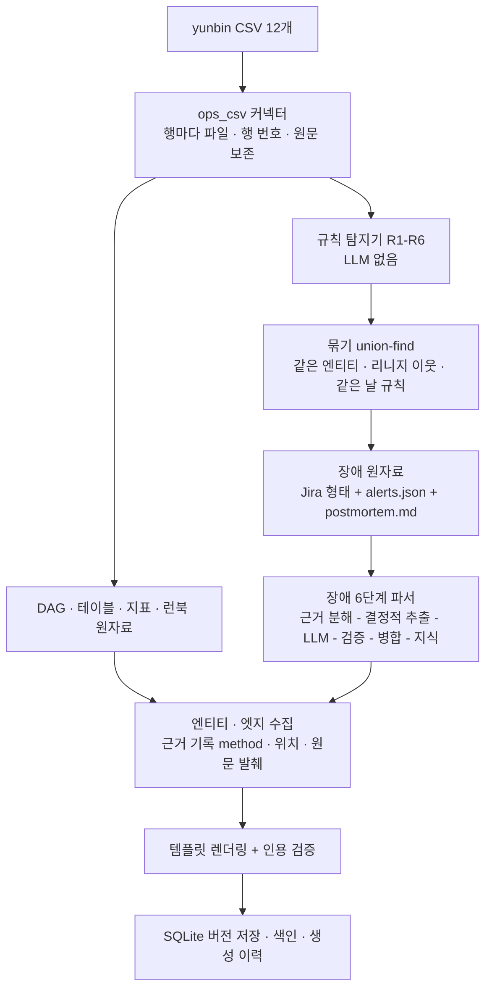
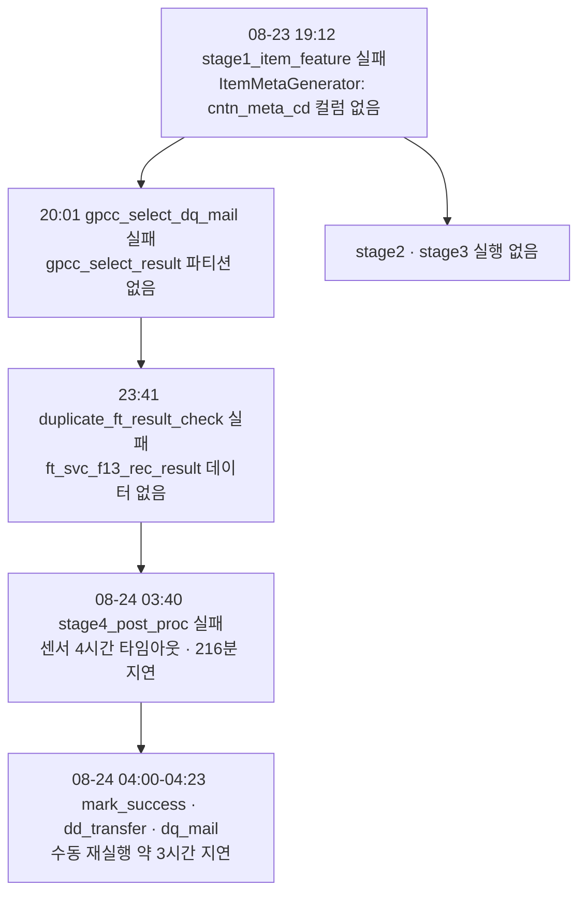

# yunbin 운영 메타데이터 지식 합성 리포트 — GPCC 카드 추천 (서비스 3f)

> 상태: **PoC 결과 v1** · 담당: huklee · 작성: 2026-09-30 · 입력: [`poc/dummy/yunbin/`](../poc/dummy/yunbin) CSV 12개 · 구현: [`ops_csv.py`](../poc/opspedia_poc/connectors/ops_csv.py) · [`ops_findings.py`](../poc/opspedia_poc/synthesis/ops_findings.py)

## 1. 한눈에 보기

- **무엇을 했나**
  - yunbin 폴더의 운영 메타데이터 CSV 12개(배치 이력 · 리니지 · 적재 · 행동 로그)를 새 커넥터 `ops_csv` 하나로 수집
  - 규칙 기반 탐지기(LLM 없음)로 이상 징후 30건 탐지 → 리니지 · 날짜로 묶어 **장애 5건** 합성
  - DAG 15 · 테이블 91 · 지표 10 · 지표 카테고리 2 · 런북 1 · 장애 5 · 시스템 / 팀 각 1 → **문서 126개 신규 생성**
- **결과 요약**
  - 엔티티 추출 612건 중 원본 CSV 행에서 표면형 확인 604건 · 계산된 관계 8건 · **원본에 없는 관계 0건**
  - 문서 속 링크 1,328개 중 **근거 없는 링크 0개**
  - 장애 5건 모두 LLM 구조화 · 인용 검증 통과 (11건 호출 · 거절 0)
- **핵심 사례 (심각도순)**
  - **YB-0823 (P2)** 08-23 소스 스키마 변경 → stage1 실패 → 하류 3개 실패 · 2개 미실행 → 08-24 전송 · 메일 약 3시간 지연
  - **YB-0820 (P2)** 08-20 행동 로그 원천 50 % 적재 (조용한 누락) → stage1 · 2 · 3 · train 입력 절반 · 노출 집계 48 %
  - **YB-0817 (P3)** 08-17 추천 결과 csno null 10,989건 → 후처리 적재 · 외부 전송까지 전파
  - **YB-0814 (P3)** 08-14 추천 대상 고객 수 −42 %
  - **YB-0815 (P3)** 08-15 gpcc_mark_success 실행 누락
- **이번에 바로잡은 로직** (§6)
  - 장애가 12건으로 쪼개지던 묶음 로직 → 테이블 경유 리니지 · 적재 마스터 · 같은 날 데이터 이상 규칙 추가로 5건
  - DAG 담당 · 시스템, 테이블 시스템 근거가 "원본 없음"으로 잡히던 문제 → CSV 열 · 설정 · 스키마 접두사로 근거 교정
  - 태스크 오류를 base_dt 로 붙여 센서 타임아웃이 떨어져 나가던 문제 → run_id 로 매칭
  - 여러 날에 걸친 장애 타임라인이 시:분만으로 정렬되던 문제 → 날짜까지 정렬 · 표시

## 2. 입력 데이터

| 폴더 | 파일 | 행 수 | 쓰임 |
|---|---|---|---|
| ops_meta | wf_task_master | 133 | 워크플로 15개 · 태스크 · 담당 팀 → DAG 페이지 |
| ops_meta | task_data_mapping | 448 | 태스크별 입력 · 출력 (테이블 66 · S3 150) → 리니지 · 테이블 페이지 |
| batch_history | batch_master | — | 기대 시작 · 종료 · 허용 지연 → SLA 판정 |
| batch_history | workflow_run_history | 398 | 실행 · 실패 (08-23 실패 4건) → R1 · R2 · R3 |
| batch_history | task_run_history | 3,423 | 태스크 오류 메시지 5종 → 실패 원인 근거 |
| ingest_aggregation | ingest_data_master | 20 | 워크플로 ↔ 원천 테이블 · 파티션 규칙 · 원천 담당 |
| ingest_aggregation | ingest_load_status · query_load_status | 558 · 1,792 | 일별 적재 행 수 → R4 |
| ingest_aggregation | ingest_metric_agg · query_metric_stats | 1,798 · 1,232 | distinct · null 품질 지표 → R5 |
| behavior_log | behavior_pattern_def · behavior_pattern_agg | 38 · 961 | 페이지 · 영역별 imp / click / conv / pv → R6 · 런북 |

- **데이터 특이점** (탐지 대상이 아닌, 원천 데이터 자체의 성질)
  - `task_run_history.run_status` 전부 비어 있음 → 태스크 성공 여부는 워크플로 상태 · 오류 메시지로만 판단
  - `try_number` = 2 가 96 % → 재시도가 일상이라 "재시도 발생"은 신호로 쓰지 않음
  - 워크플로 이름 오타 `GPCC_stage3_interaction_feautre` → 원본 그대로 엔티티 id 로 사용 (정규화하면 원본 대조 불가)
  - `duplicate_ft_result_check.check_duplicate` 는 실행 이력에만 있고 태스크 마스터에 없음
  - pv 패턴 정의 4개는 집계 행이 없음 → 런북 "수집 공백"으로 표시

## 3. 합성 흐름



- **DAG 페이지** (15)
  - 태스크 표: 입력 / 출력 테이블 · S3 경로 (`task_data_mapping`)
  - 워크플로 간 의존: 한쪽이 쓴 S3 경로를 다른 쪽이 읽으면 `depends_on` (예: stage3 `FT_InteractionFeature` ← stage1 `camp_meta`)
  - "SLA · 실행 이력" 절: 최근 14회 실행 · 지연 분 · 위반 여부 · 태스크 오류
- **테이블 페이지** (91)
  - 스키마 접두사 `wdp_bdp_db_dlk_*` → 시스템 gpcc
  - "적재 · 품질" 절: 31일 중앙값 · 최근값 · 급감일 · distinct / null 지표
- **지표** (10): 성공률 · SLA 위반 수 · 추천 결과 행 수 · 대상 고객 수 · 행동 로그 행 수 · imp / click / conv / pv · CTR
  - SLO: 성공률 · SLA 는 고정값, 나머지는 31일 중앙값 × 0.6
- **런북** RB-GPCC-001 "GPCC 행동 로그 패턴 정의": 패턴 표 · 수집 공백 · 페이지 퍼널

## 4. 탐지 규칙과 결과

| 규칙 | 조건 | 탐지 |
|---|---|---|
| R1 실패 | `run_status = failed` + 같은 run_id 태스크 오류 | 4 (crit) |
| R2 SLA 지연 | 실제 종료 − 기대 종료 > 허용 분 (가장 가까운 기대 시작에 맞춤) | 6 (crit 4 · warn 2) |
| R3 실행 누락 | 80 % 이상 매일 도는 워크플로가 특정 base_dt 에 실행 없음 | 3 (warn) |
| R4 적재량 급감 | 행 수 < 31일 중앙값 × 0.5 | 8 (crit) |
| R5 품질 이상 | distinct 가 중앙값 대비 30 % 이상 · MAD × 5 초과, 평소 0 인 null > 0 | 8 (warn) |
| R6 행동 로그 급감 | 일별 imp 합 < 중앙값 × 0.6 | 1 (crit) |

- **묶기 규칙**: 날짜 차이 1일 이내이면서 다음 중 하나
  - 같은 엔티티
  - 리니지 이웃: DAG ↔ 테이블 (`task_data_mapping` · `ingest_data_master`), DAG ↔ DAG (같은 테이블 또는 S3 경로를 쓰고 읽음)
  - 같은 날 규칙: 실패 ↔ 실행 누락, 적재량 · 품질 · 행동 로그 이상끼리
- **장애로 올리지 않은 것**: warn 급 SLA 지연만으로 된 묶음 (08-08 stage1 18분 · 08-12 stage4 32분) → DAG 페이지 SLA 이력에만 표시
- **우선순위**: crit 가 하나라도 있으면 P2, 아니면 P3

## 5. 사례별 지식 합성

### 5.1 YB-0823 — 스키마 변경 연쇄 실패 (P2)



- **묶인 탐지 10건**: 실패 4 · 실행 누락 2 · SLA 지연 4 → 영향 워크플로 9개
- **근거**: 오류 원문 `AnalysisException: cannot resolve 'cntn_meta_cd' … source table schema changed` (task_run_history)
- **합성된 지식**
  - 영향(`affected`) 엣지 9개 · 유사 장애 YB-0820 (공통 stage1 · 2 · 3), YB-0817 (공통 stage4 · dd_transfer)
  - 타임라인 15행: 결정적 10행 + LLM 보조 5행, 08-23 → 08-24 순서
- **근본 원인 (사람 확인 필요)**: 원천 `l2_msk_view` 계열 콘텐츠 메타 테이블 스키마 변경 추정. 탐지기는 원인을 단정하지 않고 첫 오류만 제시
- **런북 공백**: 스키마 변경 대응 런북 없음 → "근거에 언급된 런북 없음"

### 5.2 YB-0820 — 행동 로그 조용한 누락 (P2)

- **묶인 탐지 11건**: 적재량 급감 8 · 품질 이상 2 · 행동 로그 급감 1
- **흐름**: `hcc_cust_bhve_data` 244.7M 행 (중앙값의 50 %) · distinct csno −51 % → stage1 `log_raw` 50 % → stage2 · stage3 · train 입력 47–49 % → 노출 집계 48 %
- **의미**: 배치는 모두 성공 → 실행 이력만 보면 놓치는 사례. 적재 · 품질 지표를 리니지로 이어야 잡힘
- **합성된 지식**: 영향 워크플로 5개 · 원천 테이블 1개, 지표 `gpcc_behavior_log_rows` · `gpcc_imp` 가 같은 날 SLO 아래로 표시

### 5.3 YB-0817 — 추천 결과 null 전파 (P3)

- **묶인 탐지 3건**: 같은 값 csno null 10,989건이 `ft_svc_f13_rec_result` → stage4 `load_rec_result` → `gpcc_dd_transfer` 언로드까지
- **의미**: 외부 전송까지 나간 결함 → 실제 영향은 P3 보다 클 수 있음. 현재 규칙상 null 은 warn 이라 P3 (§7 개선 후보)

### 5.4 YB-0814 — 추천 대상 모집단 감소 (P3)

- **묶인 탐지 3건**: `f13_svc_gpcc_trgt` distinct csno 5.06M (중앙값 8.68M 대비 −42 %) · 월간 추천 · stage3 대상 쿼리 동일 값
- **의미**: 행 수는 정상 범위 → 적재량 규칙이 아닌 품질(distinct) 규칙으로만 잡힘

### 5.5 YB-0815 — mark_success 실행 누락 (P3)

- **탐지 1건**: 매일 도는 `gpcc_mark_success` 의 08-15 실행 기록 없음, 같은 날 다른 워크플로는 정상
- **의미**: 완료 표시가 빠지면 하류 센서가 기다릴 수 있음 → 단독이라 P3

## 6. 로직 재검토에서 바로잡은 것

| 문제 | 원인 | 조치 | 확인 |
|---|---|---|---|
| 장애 12건으로 쪼개짐 (0817 × 3, 0820 × 3, 0824 × 3 …) | DAG ↔ DAG 이웃을 S3 경로로만 계산, 적재 마스터 미사용 | 테이블 경유 DAG ↔ DAG · `ingest_data_master` 엣지 · 같은 날 데이터 이상 규칙 | 장애 5건 (테스트 고정) |
| stage4 실패에 "오류 메시지 없음" · 센서 타임아웃이 별도 탐지 | 태스크 오류를 base_dt 로 매칭 (타임아웃은 다음 날 base_dt) | run_id 로 매칭 | 실패 5 → 4, stage4 실패에 타임아웃 원문 |
| DAG 담당 · 시스템 관계 60건 "원본 없음" | Python DAG 용 표면형(`"owner": "…"`, 태그) 을 CSV 에 적용 | CSV `owner_team` 열 · 설정 `sources[yunbin].system` 을 근거로 | 원본 없음 0 |
| 테이블 → 시스템 182건 "원본 없음" | CSV 는 db · table 이 다른 열 → 전체 이름이 원문에 없음 | 규칙 그대로 스키마 접두사를 표면형으로 | 원본 없음 0 |
| 조치 절에 CSV 행이 "명령 실행"으로 나열 | postmortem.md 근거 행을 코드 표기(백틱)로 써서 명령어로 오인 | 근거 행을 일반 텍스트로 | 조치 절에 LLM 조치만 |
| 여러 날 타임라인 순서 뒤섞임 (08-24 03:40 이 08-23 19:12 앞) | 시:분 문자열로만 정렬 | 전체 시각으로 정렬, 날짜가 둘 이상이면 `MM-DD HH:MM` 표시 · LLM 시각은 가장 가까운 결정적 사건 날짜에 붙임 | 테스트 고정 |

- **실행 이력 화면 보강** (같은 작업 중 요청 반영)
  - `/admin/runs/{id}` 에 "생성 이력" 목록: 이 실행이 만든 문서 버전마다 모델(요청 → 대역) · 엔티티 추출 수 · 원본 대조 · 링크 수 · 소요 시간 · 해당 버전 생성 이력 링크(`#trace` · `#timing`)
  - 문서 종류 필터 · 이름 거르기, "원본 없음" · "근거 없음"은 빨간 칩으로 바로 보임

## 7. 한계와 다음 단계

- **LLM 서술 품질**
  - GPT-OSS-120B 엔드포인트 미설정 → qwen2.5:3b 대역으로 실행 (생성 이력에 요청 · 실제 모델 · 사유 기록)
  - 3B 모델은 요약 · 영향 · 근본 원인 문장이 반복되고 일반론적 → 인용 검증은 통과하지만 내용은 "리뷰 필요"
  - 결정적 부분(타임라인 · 영향 엔티티 · 탐지 근거)은 LLM 과 무관하게 정확
- **묶기 규칙의 과병합 위험**
  - "같은 날 데이터 이상은 한 장애" 규칙은 이 데이터에서는 맞지만, 서로 무관한 원천이 같은 날 흔들리면 합쳐짐
  - 개선: 같은 날 규칙에 "같은 값 전파(예: 3,043,906 · 10,989)" 또는 리니지 거리 ≤ 2 조건 추가
- **심각도**
  - null 전파가 외부 전송까지 간 경우(YB-0817) 는 P2 로 올리는 규칙 필요 (전송 · unload 태스크 도달 여부)
- **근본 원인 자동화**
  - 오류 원문 규칙표 (schema changed · no partition · SensorTimeout) → 원인 라벨 = [synthesis-scenarios S1](synthesis-scenarios.md) 과 연결
- **사용되지 않은 추출 2건**: `system:gpcc measures` 성공률 · SLA 지표 → 시스템 템플릿에 지표 절이 없어 미사용 (지표는 카테고리 · 지표 페이지에서 연결), 추적 화면에 "미사용"으로 그대로 표시

## 8. 재현

```sh
cd poc
uv run opspedia-poc run --all-backends          # 전체 (OpenSearch · Ollama)
uv run opspedia-poc -c config.lite.yaml run      # 가벼운 실행 (SQLite · mock LLM)
uv run pytest -q                                 # 45 passed
```

- 확인 경로
  - 장애: `/e/incident:YB-0823` · 생성 이력 `/e/incident:YB-0823/history?v=1#trace`
  - DAG: `/e/dag:GPCC_stage4_post_proc` (SLA · 실행 이력 절)
  - 테이블: `/e/table:wdp_bdp_db_dlk_l1_msk_view.hcc_cust_bhve_data` (적재 · 품질 절)
  - 실행 이력: `/admin` → 최근 full-sync → 생성 이력 목록
