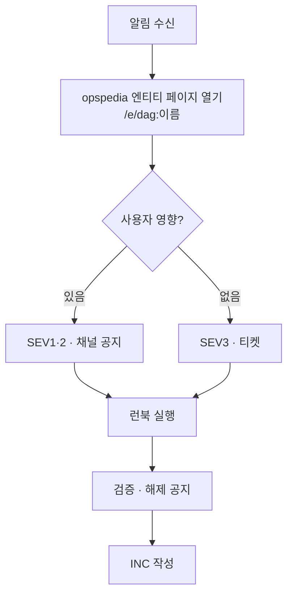

# 추천 · 검색 온콜 핸드북

> 문서 ID OPS-000 · 담당 추천 플랫폼팀 · 검색 인프라팀 · 최종 검토 2026-09-01

## 1. 심각도 정의

| 등급 | 정의 | 응답 목표 | 예 |
|---|---|---|---|
| SEV1 | 검색·추천 서비스 장애, 매출 직접 영향 | 5분 | products alias 가 빈 인덱스 가리킴, 검색 5xx |
| SEV2 | 품질 저하, 사용자 인지 가능 | 15분 | 추천 피드 미갱신, 검색 무결과율 급증 |
| SEV3 | 내부 지연, 사용자 영향 미미 | 업무 시간 | 리포트 지연, 자동완성 인덱스 지연 |

## 2. 대응 흐름

## 3. 첫 5분 체크리스트

1. 실패 DAG 페이지(`/e/dag:<dag_id>`) → 다운스트림 · 알려진 장애 · 런북 확인
2. 관련 인덱스 패밀리 상태(alias 최신성 · 문서 수) 확인
3. 지표 페이지에서 사용자 영향(CTR · 무결과율 · 신선도) 확인
4. 담당 채널 공지: 추천 → #reco-ops, 검색 → #search-ops

## 4. 주요 런북

| 상황 | 런북 |
|---|---|
| 추천 피드 미갱신 | [추천 피드 미갱신 대응 런북](reco-feed-recovery.md) |
| 랭킹 배치 OOM | [랭킹 배치 OOM 대응 런북](ranking-oom.md) |
| 상품 인덱스 전환 실패 | [상품 인덱스 alias 전환 · 롤백 런북](alias-swap-runbook.md) |
| 클러스터 yellow/red | [검색 클러스터 yellow 대응](cluster-yellow.html) |
| DAG 재실행 · clear | [DAG 재실행 표준 절차](dag-rerun-sop.md) |

## 5. 연락망

| 역할 | 채널 | 호출 |
|---|---|---|
| 추천 온콜 | #reco-ops | PagerDuty reco-primary |
| 검색 온콜 | #search-ops | PagerDuty search-primary |
| 데이터 플랫폼(Airflow·Hive) | #data-platform | PagerDuty dp-primary |

## 6. 인수인계 (매주 월 10:00)

- 진행 중 장애 · 임시 조치(메모리 상향, 일시정지 DAG) 목록 공유
- 일시정지 DAG 는 해제 담당자 · 예정일 명시 (INC-2330 재발 방지)
